# StoryCAD Test Coverage Map

```mermaid
graph TD
    Root[StoryCADTests]

    Root --> Collaborator["✅ Collaborator (5 tests)"]
    Collaborator --> CollabVM["❌ ViewModels (no tests)"]
    Collaborator --> CollabViews["❌ Views (no tests)"]

    Root --> Controls["❌ Controls (no tests)"]

    Root --> DAL["✅ DAL (6 tests)"]

    Root --> Exceptions["❌ Exceptions (no tests)"]

    Root --> Models["✅ Models (4 tests)"]
    Models --> ModelsScrivener["❌ Scrivener (no tests)"]
    Models --> ModelsTools["❌ Tools (no tests)"]

    Root --> Services["✅ Services (2 tests)"]
    Services --> API["✅ API (1 test)"]
    Services --> Backend["✅ Backend (1 test)"]
    Services --> Backup["❌ Backup (no tests)"]
    Services --> SvcCollab["✅ Collaborator (1 test)"]
    SvcCollab --> Contracts["✅ Contracts (1 test)"]
    Services --> Dialogs["❌ Dialogs (no tests)"]
    Dialogs --> DialogTools["❌ Tools (no tests)"]
    Services --> IoC["✅ IoC (1 test)"]
    Services --> Json["✅ Json (1 test)"]
    Services --> Locking["✅ Locking (1 test)"]
    Services --> Logging["❌ Logging (no tests)"]
    Services --> Messages["❌ Messages (no tests)"]
    Services --> Navigation["❌ Navigation (no tests)"]
    Services --> Outline["✅ Outline (4 tests)"]
    Services --> Ratings["❌ Ratings (no tests)"]
    Services --> Reports["✅ Reports (1 test)"]
    Services --> Search["✅ Search (1 test)"]

    Root --> ViewModels["✅ ViewModels (8 tests)"]
    ViewModels --> SubViewModels["❌ SubViewModels (no tests)"]
    ViewModels --> VMTools["✅ Tools (2 tests)"]

    classDef hasCoverage fill:#90EE90,stroke:#2d5016,stroke-width:2px,color:#000
    classDef noCoverage fill:#FFB6C6,stroke:#8b0000,stroke-width:2px,color:#000

    class Collaborator,DAL,Models,Services,API,Backend,SvcCollab,Contracts hasCoverage
    class IoC,Json,Locking,Outline,Reports,Search,ViewModels,VMTools hasCoverage
    class CollabVM,CollabViews,Controls,Exceptions,ModelsScrivener,ModelsTools noCoverage
    class Backup,Dialogs,DialogTools,Logging,Messages,Navigation,Ratings,SubViewModels noCoverage
```

    ## Summary

    **Areas with Test Coverage:** ✅ (Green)
    - Collaborator (5 tests)
    - DAL (6 tests)
    - Models (4 tests)
    - Services (2 tests)
    - Services/API (1 test)
    - Services/Backend (1 test)
    - Services/Collaborator (1 test)
    - Services/Collaborator/Contracts (1 test)
    - Services/IoC (1 test)
    - Services/Json (1 test)
    - Services/Locking (1 test)
    - Services/Outline (4 tests)
    - Services/Reports (1 test)
    - Services/Search (1 test)
    - ViewModels (8 tests)
    - ViewModels/Tools (2 tests)

    **Areas WITHOUT Test Coverage:** ❌ (Red/Pink)
    - Collaborator/ViewModels
    - Collaborator/Views
    - Controls
    - Exceptions
    - Models/Scrivener
    - Models/Tools
    - Services/Backup
    - Services/Dialogs
    - Services/Dialogs/Tools
    - Services/Logging
    - Services/Messages
    - Services/Navigation
    - Services/Ratings
    - ViewModels/SubViewModels

    **Coverage Statistics:**
    - **Total folders:** 34
    - **Folders with tests:** 16 (47%)
    - **Folders without tests:** 18 (53%)
    - **Total test files:** 42
