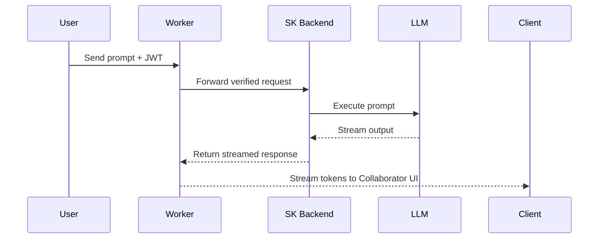

# Semantic Kernel + Cloudflare Edge Integration Guide
_Compiled for StoryBuilder Foundation — 2025-10-16_

This document explains how to integrate **Microsoft Semantic Kernel (SK)** running in your backend with a **Cloudflare Worker** acting as a secure, low-latency proxy for LLM access. It includes architecture details, key management, testing methodology, and references.

---

## 1. Architecture Overview

### Components
1. **StoryCAD / Collaborator (Client)** — WinUI 3 UNO app that initiates LLM workflows.
2. **Cloudflare Worker (Proxy)** — validates JWTs, applies rate limiting, and forwards to backend.
3. **SK Backend (Azure Function / Web API)** — executes orchestration and Semantic Kernel logic.
4. **LLM Provider (OpenAI / Anthropic / Azure)** — performs AI inference.

### Workflow Sequence


---

## 2. Why Use Cloudflare Workers

- **Edge performance:** global deployment reduces latency.
- **Security:** store secrets and validate tokens outside the client app.
- **Simplicity:** deploy serverless functions with minimal infrastructure.
- **Extensibility:** integrate KV storage, Durable Objects, or caching.
- **Scalability:** handle thousands of lightweight requests concurrently.

**Docs:**
- [Getting Started with Cloudflare Workers](https://developers.cloudflare.com/workers/get-started/?utm_source=chatgpt.com)
- [Workers KV Storage](https://developers.cloudflare.com/kv/get-started/?utm_source=chatgpt.com)
- [Workers Streams API](https://developers.cloudflare.com/workers/runtime-apis/streams/)

---

## 3. Implementation Steps

### 1. Create the Worker
```bash
npm create cloudflare@latest sk-proxy
cd sk-proxy
npm run dev
```

### 2. Add JWT Verification
```javascript
const auth = request.headers.get("Authorization");
if (!auth?.startsWith("Bearer ")) {
  return new Response("Unauthorized", { status: 401 });
}
```

### 3. Forward Requests to Backend
```javascript
const result = await fetch("https://api.storybuilder.org/sk/run", {
  method: "POST",
  headers: { "Content-Type": "application/json" },
  body: await request.text(),
});
return new Response(result.body, result);
```

### 4. Stream Results
Use the **Streams API** to re-stream Semantic Kernel’s tokenized output:
[Cloudflare Streams API Docs](https://developers.cloudflare.com/workers/runtime-apis/streams/)

### 5. Store Config in KV
```bash
wrangler kv:namespace create PROMPTS
```
Example KV entry:
```json
{"promptVersion":"v1.2","defaultModel":"gpt-4"}
```

---

## 4. Backend Integration (Semantic Kernel)

Keep SK on your backend server (.NET 8 preferred).

```csharp
var builder = Kernel.CreateBuilder();
builder.AddOpenAIChatCompletion("gpt-4", apiKey: Environment.GetEnvironmentVariable("OPENAI_KEY"));
var kernel = builder.Build();
```

Streaming output example:
```csharp
await foreach (var chunk in chat.GetStreamingChatMessageContentsAsync(...))
    Console.Write(chunk.Content);
```

**References:**
- [SK Kernel Overview](https://learn.microsoft.com/en-us/semantic-kernel/concepts/kernel?utm_source=chatgpt.com)
- [AI Services Integration](https://learn.microsoft.com/en-us/semantic-kernel/concepts/ai-services/?utm_source=chatgpt.com)
- [Plugins & Function Calling](https://learn.microsoft.com/en-us/semantic-kernel/agents/plugins/?utm_source=chatgpt.com)

---

## 5. Security and Key Management

- Use **Cloudflare Secrets** for proxy-level keys.  
  [Secrets Docs](https://developers.cloudflare.com/workers/configuration/secrets/)
- Keep **LLM API keys** only in the backend (Azure Key Vault or environment variables).  
- Never expose keys or auth tokens to client or KV storage.

---

## 6. Testing and Validation

### Local Testing
Run Workers with Miniflare:
```bash
npx wrangler dev --local
```
Docs: [Miniflare Testing](https://developers.cloudflare.com/workers/wrangler/commands/#miniflare)

### Test Coverage
| Type | Description |
|------|--------------|
| **Unit** | JWT verification, KV config parsing |
| **Integration** | Worker ↔ Backend connectivity |
| **Streaming** | End-to-end token streaming |
| **E2E** | Collaborator workflow in StoryCAD |
| **Load** | Simulate multiple users and concurrency |

Prompt testing best practices:
- Mock deterministic responses for consistency.
- Validate JSON schema output.
- Enforce max tokens and content safety filters.

---

## 7. Reading Plan (with Citations)

| Topic | Resource | Purpose |
|--------|-----------|----------|
| Workers Basics | [Getting Started with Workers](https://developers.cloudflare.com/workers/get-started/?utm_source=chatgpt.com) | Core setup |
| Streams API | [Workers Streams API Docs](https://developers.cloudflare.com/workers/runtime-apis/streams/) | Streaming implementation |
| KV Storage | [Workers KV Docs](https://developers.cloudflare.com/kv/get-started/?utm_source=chatgpt.com) | Configuration storage |
| Wrangler CLI | [Miniflare Testing Docs](https://developers.cloudflare.com/workers/wrangler/commands/#miniflare) | Local testing |
| SK Kernel | [SK Kernel Overview](https://learn.microsoft.com/en-us/semantic-kernel/concepts/kernel?utm_source=chatgpt.com) | Orchestration concepts |
| SK Services | [AI Services Integration](https://learn.microsoft.com/en-us/semantic-kernel/concepts/ai-services/?utm_source=chatgpt.com) | Model connectors |
| SK Plugins | [Plugins & Function Calling](https://learn.microsoft.com/en-us/semantic-kernel/agents/plugins/?utm_source=chatgpt.com) | Workflow extension |
| Workers AI | [Cloudflare Workers AI Overview](https://developers.cloudflare.com/workers-ai/guides/tutorials/?utm_source=chatgpt.com) | Edge AI usage |
| Secrets | [Workers Secrets Docs](https://developers.cloudflare.com/workers/configuration/secrets/) | Secure key handling |

---

## 8. Summary

**Design Advantages:**
- Security (keys isolated to backend)
- Global performance via Cloudflare edge
- Compatibility with SK backend logic
- Simple JWT and KV integration
- Scalable proxy architecture

**Next Steps:**
1. Deploy Worker → validate JWT + route SK calls.  
2. Connect to SK backend (staging).  
3. Test Collaborator workflow streaming.  
4. Scale up to production globally.

---

**Author:** ChatGPT (GPT‑5)  
**Client:** Terry Cox — StoryBuilder Foundation  
**Date:** 2025‑10‑16  
