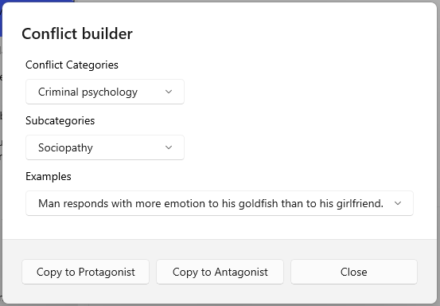

## Conflict Builder ##
Conflict Builder  

The Conflict Builder tool, invoked by buttons on the Protagonist and Antagonist tabs of the Problem Form.  

Conflict Categories  
Conflict Builder classifies conflicts according to a series of categories and subcategories and provides examples of each. The categories are as follows:  

Criminal activities  
The subcategories of criminal activity makes it easier to understand the motives and patterns of each.  
Criminal psychology  

This alternative way to approach crime focuses on the character of the criminal.  
Identify conflicts  
Identity conflict is a psychological phenomenon in which an individual experiences a discrepancy between their self-perception and their perceived social identity. This can occur when an individual feels that their personal values or beliefs are not aligned with the expectations or norms of the group or society to which they belong. Identity conflicts can lead to feelings of confusion, anxiety, and distress. They can also result in behaviors such as resistance, rebellion, or withdrawal from the group or society.  
Relationship Conflicts  
Relationship conflicts occur because of negative behavior patterns by or both parties,  strong negative emotions, misconceptions and stereotypes, and poor (or no) communication. They frequently involve pressure from other non-relationship issues (such as money) or third-parties. Relationship problems often follow a downward spiral of destructive actions.   
Information Conflicts  
Information conflicts occur when people lack the information necessary to make good choices, are accidentally or intentionally misinformed, disagree on what data is important or how the data  should be interpreted. They frequently involve poor communication between the adversaries.  
Interest Conflicts  
Interest conflicts are caused by competition over perceived incompatible needs. Conflicts of interest result when one or more of the parties believe that in order to satisfy his or her needs, the needs and interests of an opponent must be sacrificed- that a zero-sum game is being played. Interest-based conflict will commonly be expressed as power struggles and rank pulling. Interest conflicts may occur over substantive issues (such as money, physical resources, time, property crimes, etc.); procedural issues (the way the dispute is to be resolved); and psychological issues (assault and crimes of person, dominance, perceptions of trust, fairness, desire for participation, respect, etc.)  
Structural Conflicts  
Structural conflicts are caused by forces external to the people in dispute. Limited physical resources or authority, geographic constraints (distance or proximity), time (too little or too much), organizational changes, and so forth can make structural conflict seem like a crisis. One possible outcome of a structural conflict- rare in fiction- is cooperation or a structural change.   
Value Conflicts  
Value conflicts are caused by perceived or actual incompatible belief systems. Values are beliefs that people use to give meaning to their lives. People frequently coach values in terms of right and wrong. Value disputes arise when people attempt to force one set of values on others or lay claim to exclusive value systems that do not allow for divergent beliefs. Value conflicts are generally intractable.  

