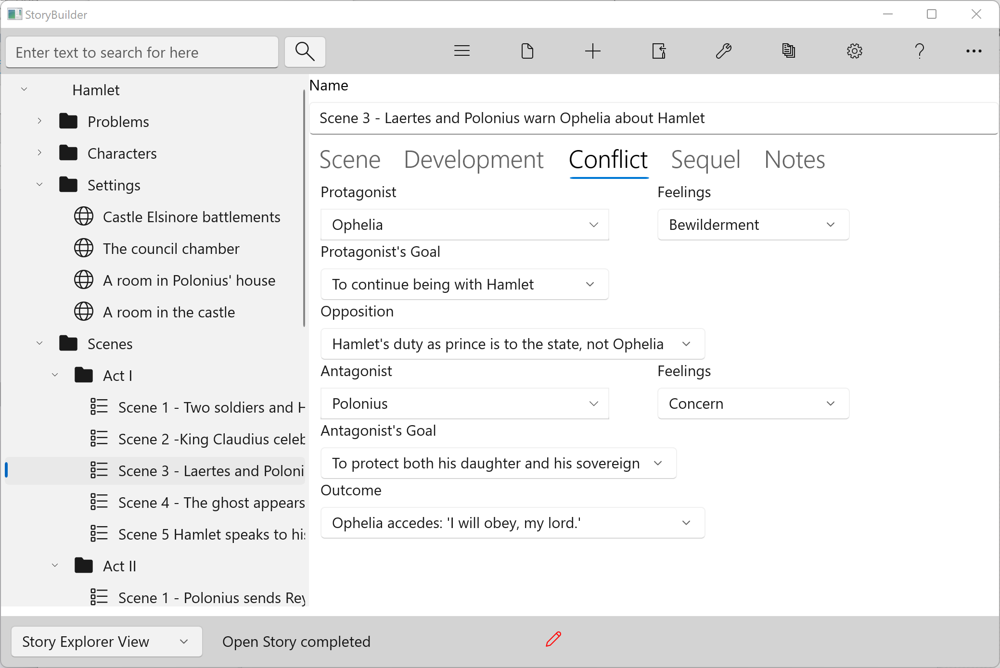

### Conflict Tab ###
Conflict Tab  

The Conflict tab helps define the drama in a scene.  

A scene is a 'small story', which has the same key elements of the overall story: a goal,  opposition to that goal, and an outcome.  The Conflict tab compresses the elements on the Problem form into a single tab.  

Protagonist and Antagonist  
These roles are selected from the list of characters defined on the Characters form.  

Feelings  
Motive is modified, at the scene level, into an emotional response which is specific to the character and the scenic action.  This control lists some common emotions.  

Goal  
The goal is the character's purpose or objective.  

Opposition  
The nature of the resistance to the Protagonist's goal.  

Outcome  
The result of the scene, from the Protagonist's point of view.  Most scenes should end in a disaster or failure to reach the scene's goal, lest the story end too easily.  

The Dramatic Situations tool on the Plotting Aids sub‑  menu of the Tools  menu can help to define a scene's conflict, and works with the Conflict tab.  

   
[Previous - Develpment Tab](Develpment_Tab.md)   
[Next up - Sequel Tab](Sequel_Tab.md)
