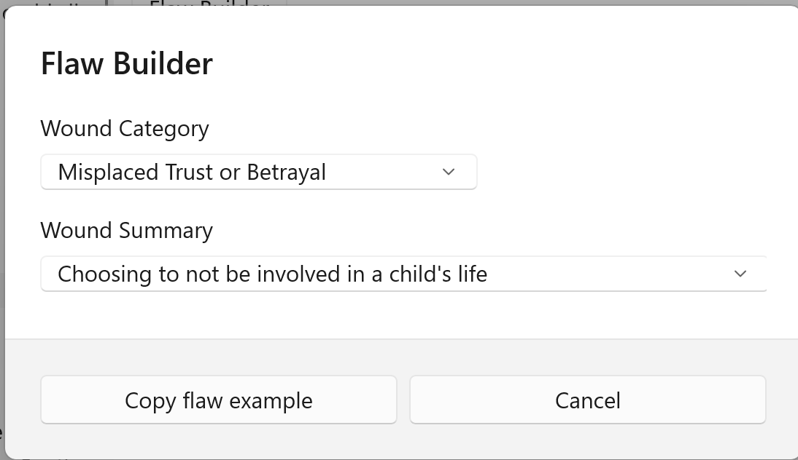

## Flaw Builder ##
Flaw Builder  

This tool is invoked from a button on the Character Form’s Flaw tab. It explores some common examples of character flaws to help you in developing a character.  

Generally, a character flaw should become a problem of its own, a ‘person against himself’ or internal problem. The Problem Type is usually discovery; self-awareness is the start of the solution. The failure to overcome a flaw is tragic: Hamlet’s indecision is an example.  

   
[Previous - Conflict Builder](Conflict_Builder.md)   
[Next up - Reports](Reports.md)
