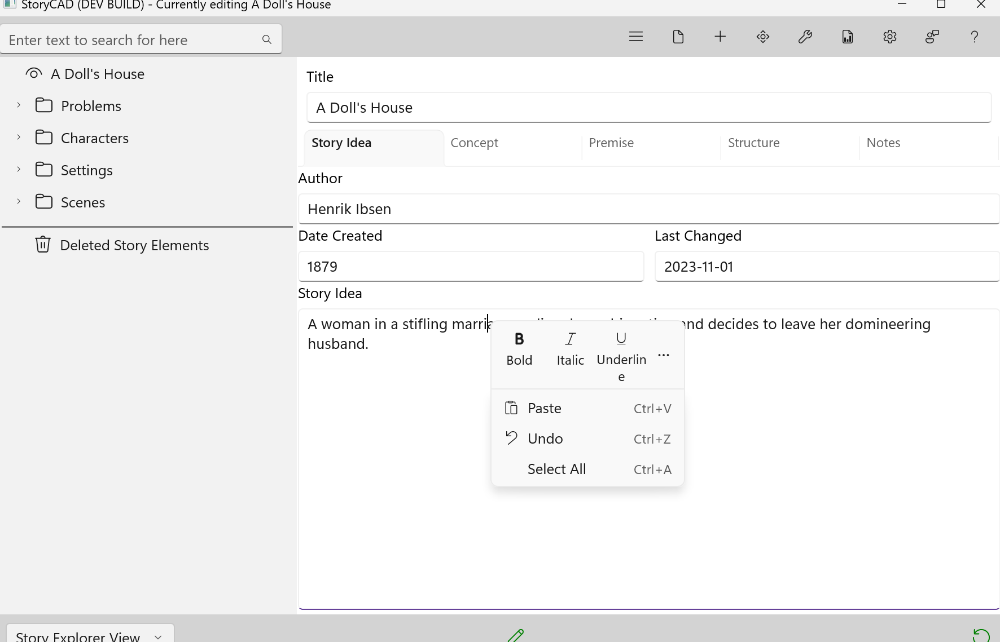

## Platform Differences

StoryCAD is available on Windows and macOS. All outlining and story planning features work identically across platforms, with differences only in text editing capabilities.

### Text Editing

| Feature | Windows | macOS |
|---------|---------|-------|
| Rich text formatting (bold, italic, underline) | Yes | No |
| Font and color changes | Yes | No |
| Formatting toolbar | Yes | No |
| Right-click formatting menu | Yes | No |
| Spell checking | Yes | No |

**Windows** supports rich text formatting (RTF) with a formatting toolbar. You can apply bold, italic, underline, change fonts and colors, adjust paragraph alignment, and create lists. Right-clicking in text fields displays a formatting menu:

Windows includes spell checking across all text entry controls. Misspelled words display red underlines, and right-clicking offers spelling suggestions.

**macOS** uses plain text editing only. Text formatting features, right-click formatting menus, and spell checking are not available.

### File Compatibility

StoryCAD .stbx outline files are fully compatible between Windows and macOS. You can create an outline on one platform and open it on the other. Your story content, structure, and all story elements transfer seamlessly.

**Important**: Text formatting applied on Windows will be permanently removed when a file is opened and saved on macOS. The text content is preserved, but formatting (bold, italic, fonts, colors) is stripped and cannot be recovered.

### Cross-Platform Recommendations

If you work on both platforms:

- **Keep formatting minimal** if regularly moving files between platforms
- **Maintain separate copies** - Windows copy for formatted content, macOS copy for plain text
- **Use Windows exclusively** for outlines that need text formatting
- **Use external formatting** - Keep formatted versions in Word or Google Docs for reference

The macOS text editing limitation is due to platform constraints, not a design choice.
