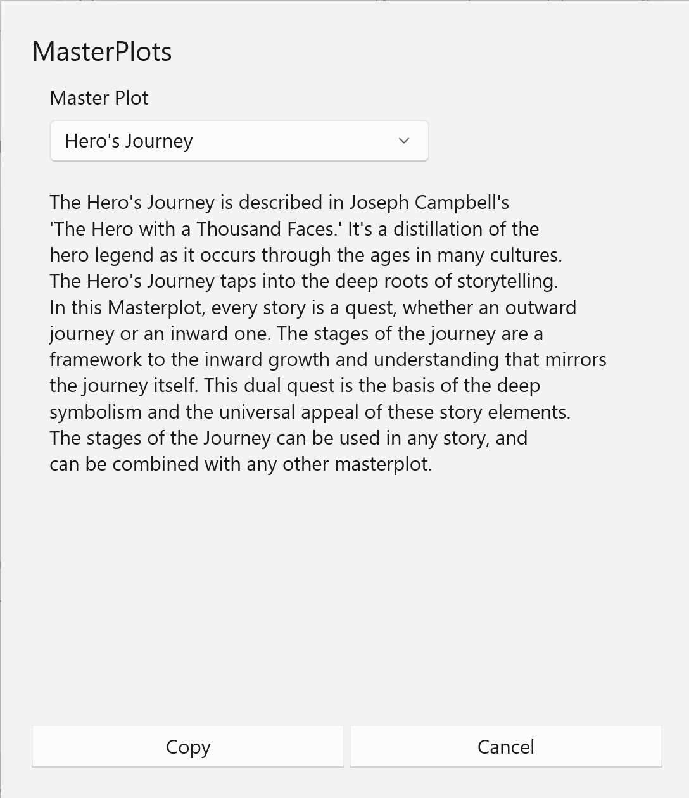

### Master Plots ###
1  
Master Plots  

Plots tend to include the same story elements.  Aristotle was the first to identify and expand upon some of these elements, which have been elaborated in the centuries since his time.  These elements have to do with the shape of the plot.  

The same story forms also repeat themselves in fiction: stories of adventure, discovery, pursuit, etc.  Stories based upon one or more of these forms will tend to repeat certain story elements.  

StoryCAD's Master Plots tool helps you shape your story's plot based on suggestions from these two sources.  

The Master Plots tool is invoked from the Plotting Aids sub-menu of the Tools menu.  It provides a list of plot skeletons, or master plots.  Selecting one of the master plots from the list at the top of the form will display  notes relevant to that master plot.   

The first few master plots (Three Act Play, W-Diagram,  and Hero's Journey) are story outlines.  Selecting Copy when one of these master plots is selected will copy a skeleton plot into your plot outline, which can then be edited from the Plot form. The remaining master plots concern story forms or patterns.  Selecting Copy when one of these master plots is selected will add a plot point to your  plot outline.  This plot point contains notes and suggestions for stock scenes which are relevant to this story form.  You can copy more than one master plot into an outline.  

Ronald Tobias' excellent book 20 Master Plots (And How to Build Them) is a detailed look at the fundamental plots which recur through all fiction.  

   
[Previous - Plotting Aids](Plotting_Aids.md)   
[Next up - Dramatic Situations](Dramatic_Situations.md)
