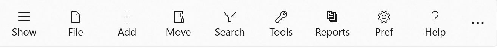
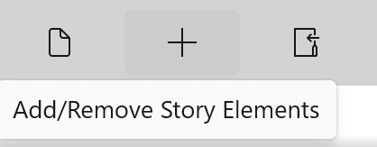

### Menu Bar ###
Menu Bar  

The Menu bar is located just below the title bar on the StoryCAD form and provides access to StoryCAD’s common tasks.  

Clicking the See more (...) button will display labels below each menu button:  

Clicking the same button will toggle the button labels off again.  

Hovering your mouse or stylus over a button will display a tool tip describing the button’s function:  

The menu bar buttons either display drop-down menus (such as File), or launch particular actions (such as Preferences.)  

[Search](Search.md)   
[Show/Hide Navigation Pane](Show_Hide_Navigation_Pane.md)   
[File Menu](File_Menu.md)   
[Add/Remove Story Elements](Add_Remove_Story_Elements.md)   
[Move Story Elements](Move_Story_Elements.md)   
[Tools Menu](Tools_Menu.md)   
[Reports](Reports.md)   
[Preferences](Preferences.md)   
[Key Binds](Key_Binds.md)   
   
[Previous - The StoryCAD User Interface](The_StoryCAD_User_Interface.md)   
[Next up - Search](Search.md)
