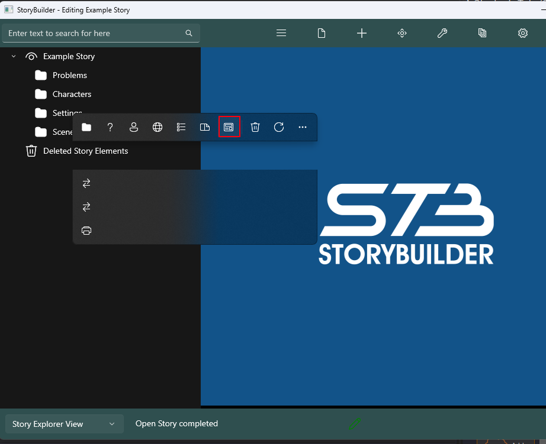

# Miscellaneous #
Changelog Pop-up / What’s new menu  
Occasionally, when StoryBuilder updates a window will be shown. This will summarise what has changed in this update and which developer made that change.  

If you decide you want to see this popup again, you can access it in Preferences  

Developing StoryBuilder  
If you are a C# developer and are somewhat familar with WinUI (or another XAML based UI language) then you can contribute to StoryBuilder (Which is written in C# and uses WinUI 3).  
for more information about contributing, please check the GitHub Repository.  

Developer only menus / pop-ups  

If you have cloned storybuilder and built it for the first time then you may be surprised to see this screen, this is because a key file is missing from your local clone. This will not cause any issues with the app functioning however your copy will not report errors via Elmah.io and you may see pops such as syncfusion licensing errors.  
Regardless, congratulations on successfully compiling StoryBuilder.  

If StoryBuilder notices you have a debugger attached to the process, the developer menu will appear.  
This shows info about the computer and may contain buttons to test some parts of the storybuilder.  
If running without a keyfile (which is standard for those contributing to the storybuilder project.) then some of these buttons may not work or cause intended behavior.  

As such this menu may be removed, updated or abandoned at any point.  
(This menu can also be forced to shown by setting your name to ShowMeTheDevTab)  

Developing StoryBuilder  
If you are a C# developer and are somewhat familar with WinUI (or another XAML based UI language) then you can contribute to StoryBuilder (Which is written in C# and uses WinUI 3).  
for more information about contributing, please check the GitHub Repository.  

Developer only menus / pop-ups  

If you have cloned storybuilder and built it for the first time then you may be surprised to see this screen, this is because a key file is missing from your local clone. This will not cause any issues with the app functioning however your copy will not report errors via Elmah.io and you may see pops such as syncfusion licensing errors.  
Regardless, congratulations on successfully compiling StoryBuilder.  

If StoryBuilder notices you have a debugger attached to the process, the developer menu will appear.  
This shows info about the computer and may contain buttons to test some parts of the storybuilder.  
If running without a keyfile (which is standard for those contributing to the storybuilder project.) then some of these buttons may not work or cause intended behavior.  

As such this menu may be removed, updated or abandoned at any point.  
(This menu can also be forced to shown by setting your name to ShowMeTheDevTab)  

