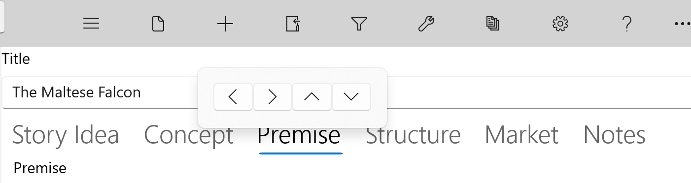

#### Move Story Elements ####
Move Story Elements  

The Move Story Element button displays a pop-up which allows you to move the selected Story Element node on the Navigation Pane up, down, left, or right. The one exception is the root of the Navigation node tree, Story Overview.   

(Hint: you can also just drag and drop a node from place to place.)  

   
[Previous - Add/Remove Story Elements](Add_Remove_Story_Elements.md)   
[Next up - Tools Menu](Tools_Menu.md)
