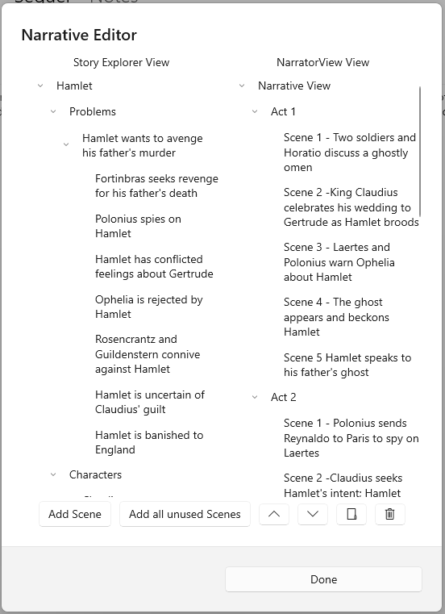

## Narrative Editor ##
Narrative Editor  
As is discussed in Story Explorer and Story Narrator Views, the sequence of scenes you choose to tell your story in (it’s narrative order) will frequently be different than the order you create the scenes as you develop your outline in Story Explorer.  
You can move a scene from Story Explorer to Story Narrator at any time with the aid of the Navigation Pane Flyout Command Bar’s ‘Move to Narrative’ button, but another tool, Narrative Editor, can help you quickly develop your Narrator View by moving scenes en masse. This might be done late in the outline’s development, for instance.  

Once you open the Narrative Editor, it will look similar to this. On one side you will the Story Explorer View (The view where you plan your story) and the Narrator View (This is the view that shows your story as it’s told.)   

The Narrative view is different from the Explorer view and contains only Scenes and Sections. Along the bottom there are several buttons:  

	•	Add Scene - Adds a node from the Story Explorer View (Only scenes and folders can be copied over, other types will not be copied over)  
	•	Add all unused scenes  - Copies all scenes in the explorer view that are not currently contained in the Narrative view.  
	•	^/v - Moves the selected node will be moved up / down   
	•	Folder Icon - Creates a Section (Chapter, Act, etc.) in the narrator view  
	•	Trash Icon - Removes a Narrator View node  

The Done button closes the Narrative Editor when you’re finished.  

