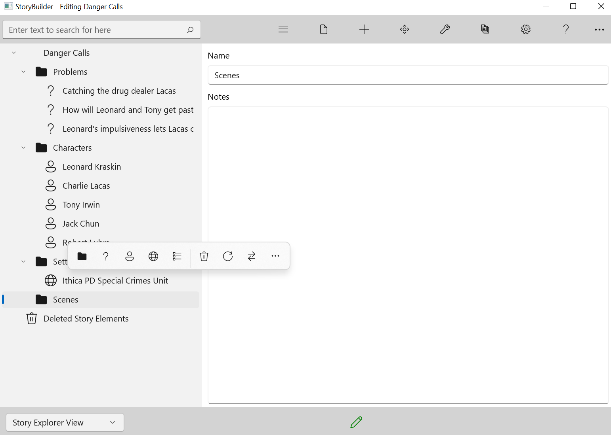

### Navigation Pane Flyout CommandBar ###
Navigation Pane Flyout Commands  

Right-clicking any node on the Navigation Pane will display a  flyout command bar:  

In order of top to bottom, the flyout items do the following:  

&nbsp;&nbsp;&nbsp;&nbsp;•&nbsp;&nbsp;&nbsp;&nbsp;Add Elements - Allows you to add a new Story Element such as a Problem, folder, character
&nbsp;&nbsp;&nbsp;&nbsp;•&nbsp;&nbsp;&nbsp;&nbsp;Delete Element - Sends the element to the Trash
&nbsp;&nbsp;&nbsp;&nbsp;•&nbsp;&nbsp;&nbsp;&nbsp;Restore Element - Remove the element from the Trash
&nbsp;&nbsp;&nbsp;&nbsp;•&nbsp;&nbsp;&nbsp;&nbsp;Add to Narrative - This adds the element to the Narrative View
&nbsp;&nbsp;&nbsp;&nbsp;•&nbsp;&nbsp;&nbsp;&nbsp;Remove From Narrative - This removes the element from the Narrative View.
&nbsp;&nbsp;&nbsp;&nbsp;•&nbsp;&nbsp;&nbsp;&nbsp;Print Node -  This quickly prints a report for that element.

   
[Previous - Story Elements](Story_Elements.md)   
[Next up - Tabs](Tabs.md)
