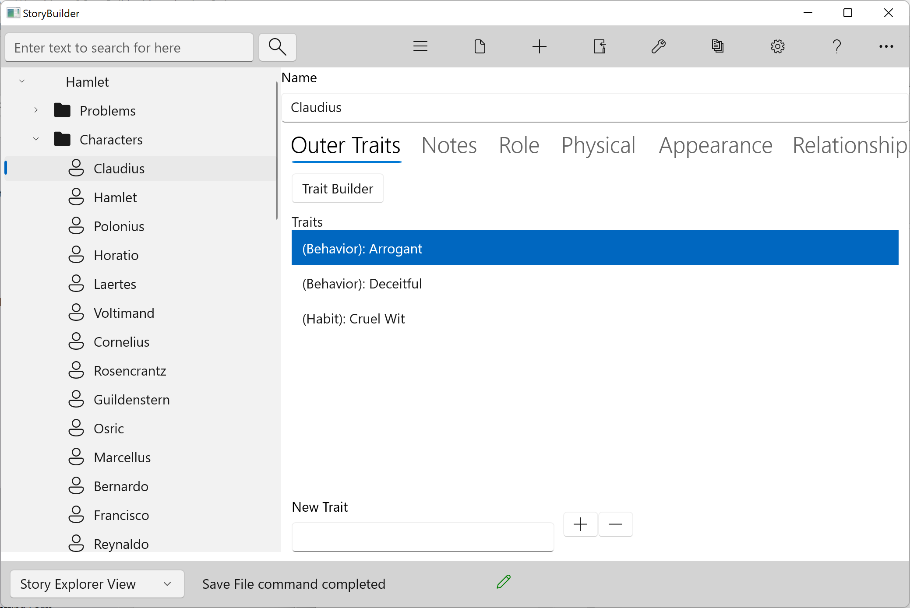
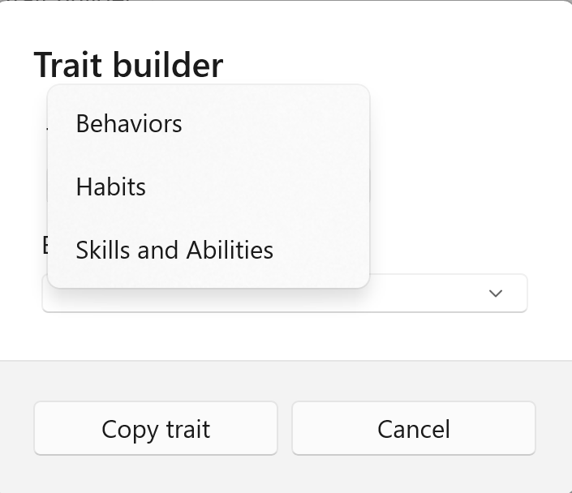

### Outer Traits ###
Outer Traits Tab  

Trait Builder  

This tool provides several categories of examples of outer (external) traits.  

When you assign one of these traits to your character, think of how he came to have this characteristic.  Was there some incident in his background or element in his upbringing which fostered this trait? The Backstory Tab can be used to record this.  

   
[Previous - Inner Traits](Inner_Traits.md)   
[Next up - Setting Form](Setting_Form.md)
