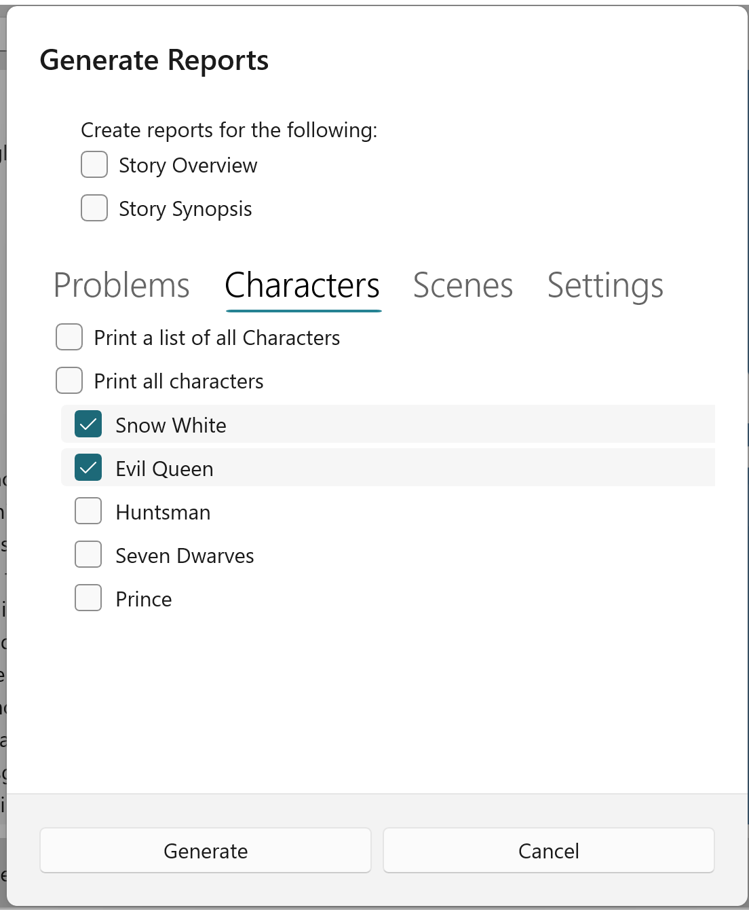

## Print Reports ##
Print Reports  

If you select the Print Reports option, a dialog will appear which allows you to check the particular reports you wish to print:  

On Windows 11 systems, StoryCAD provides a Print Manager which allows you to select a printer and its options, and to display reports in a Print Preview window:  

If you’re running Windows 10, Clicking Generate will cause all of the selected reports to print on your default printer.  
