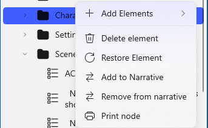

## Add/Remove Story Elements

You can add or remove Story Elements in two ways. There’s a Menu Bar button which opens an ‘Add/Remove Story Elements’ menu:

There’s also a pop-up menu which displays when you right-click on any Story Element node in the Navigation Pane:

(Hint: Holding your mouse or stylus over any of the buttons on a menu or pop-up menu will display a tip describing the button.)

The Remove Element button (trashcan icon) moves a Story Element to the Trashcan.

The Add to Narrative/Remove from Narrative buttons copy a Scene story element to the Narrative Explorer View or remove it from that view.  These do not remove the Scene from Story Explorer View.
