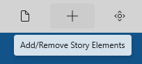
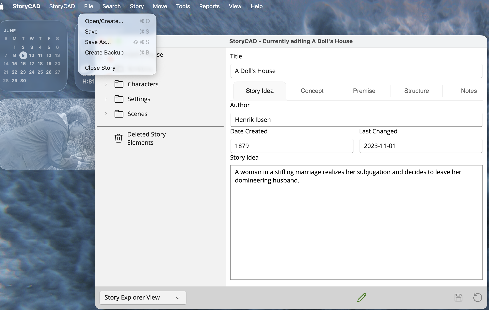

### Menu Bar
The Menu bar is located just below the title bar on the StoryCAD form and provides access to StoryCAD’s common tasks.

Hovering your mouse or stylus over a button will display a tool tip describing the button’s function:

The menu bar buttons either display drop-down menus (such as File), or launch particular actions (such as Preferences.)

### macOS

On macOS, StoryCAD also provides a native menu bar at the top of the screen. It contains the same commands as the in-window toolbar.

To hide the in-window toolbar and use only the native menu bar, open Preferences and turn off **Hide in-window toolbar** on the Other tab. The change takes effect on the next launch.