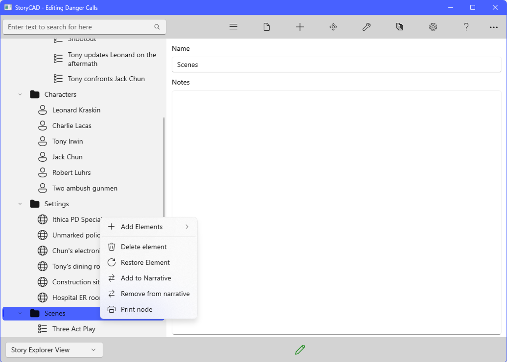

### Navigation Pane Flyout CommandBar
Navigation Pane Flyout Commands

Right-clicking any node on the Navigation Pane will display a  flyout command bar:

In order of top to bottom, the flyout items do the following:

	•	Add Elements - Allows you to add a new Story Element such as a Problem, folder, character
	•	Delete Element - Sends the element to the Trash
	•	Restore Element - Remove the element from the Trash
	•	Add to Narrative - This adds the element to the Narrative View
	•	Remove From Narrative - This removes the element from the Narrative View.
	•	Print Node -  This quickly prints a report for that element.

