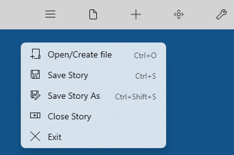
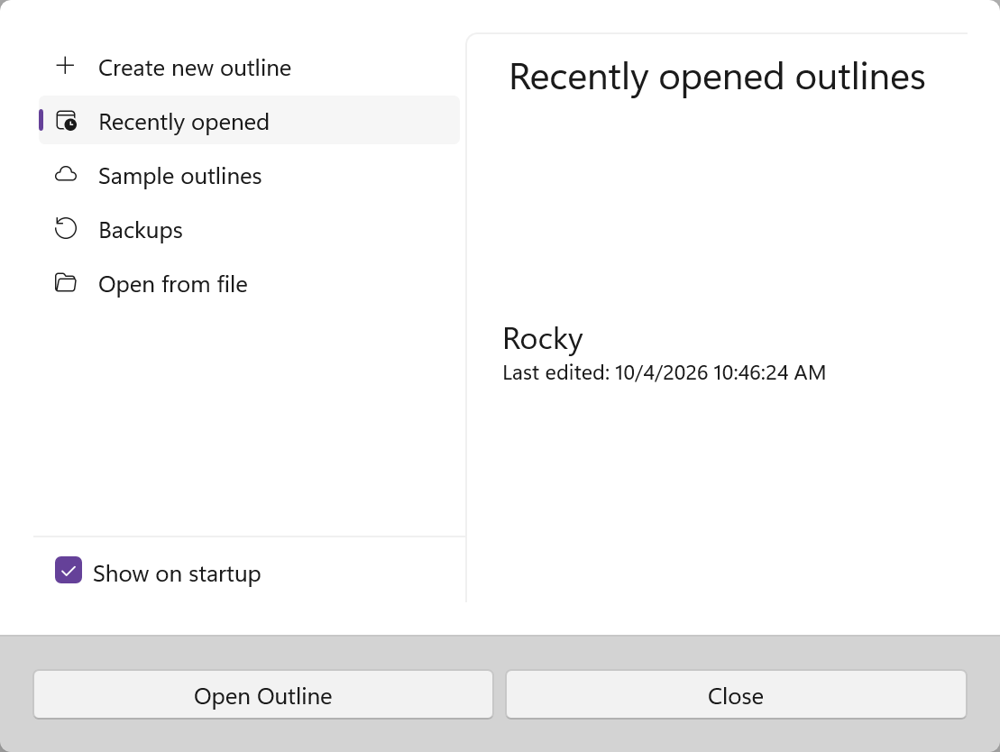
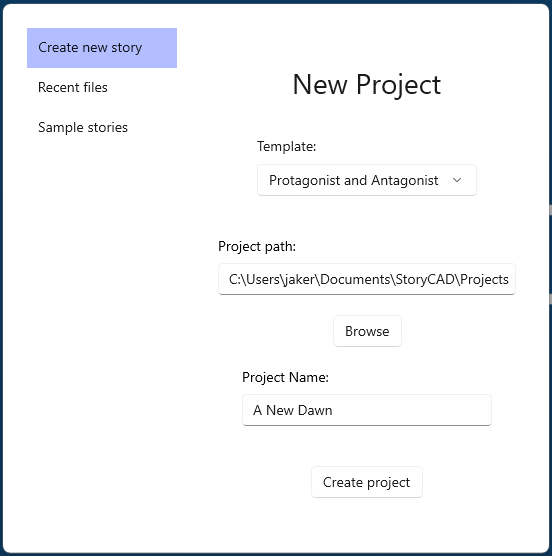

## Reading and Writing Outlines

The File Menu button displays a drop-down menu of file options:

A StoryCAD outline is a single file with a file extension of .stbx: for instance, 'The Maltese Falcon.stbx.'   A StoryCAD file can be moved, copied, etc.

StoryCAD .stbx files are fully compatible across Windows and macOS. See [Platform Differences](../Front%20Matter/Platform_Differences.html) for details on text formatting differences between platforms.

The Open command identifies which outline you wish to work on. The Save command will save the file with the same name it with which it was opened or previously saved. The Save As command will save an outline under a new name or at a new location. 

File Open displays the following open dialog:

The dialog opens on Recently opened, which lists the outlines you worked on last and when each was last edited. Click an outline, then click Open Outline. The other choices on the left are:

- **Create new outline** starts a new outline. The Project path defaults to the folder specified in Preferences.
- **Sample outlines** lists the sample outlines that come with StoryCAD. Changes to a sample are lost unless you save it somewhere else.
- **Backups** lists your backup copies, newest first. Click one, then click Open backup.
- **Open from file** opens a file browser so you can pick any outline on your computer.

Clear **Show on startup** if you don't want this dialog to appear when StoryCAD starts. Click Close to leave the dialog without opening anything.

Create new outline displays this page:

 
Clicking on Sample Stories on the left tab displays a list of sample outlines installed with StoryCAD for you to play with. If you intend to change a sample, we recommend saving it to a different location before doing so.

Only one story outline can be open at a time.  If you open a new file you'll be prompted to save the current file first if it’s been modified.

