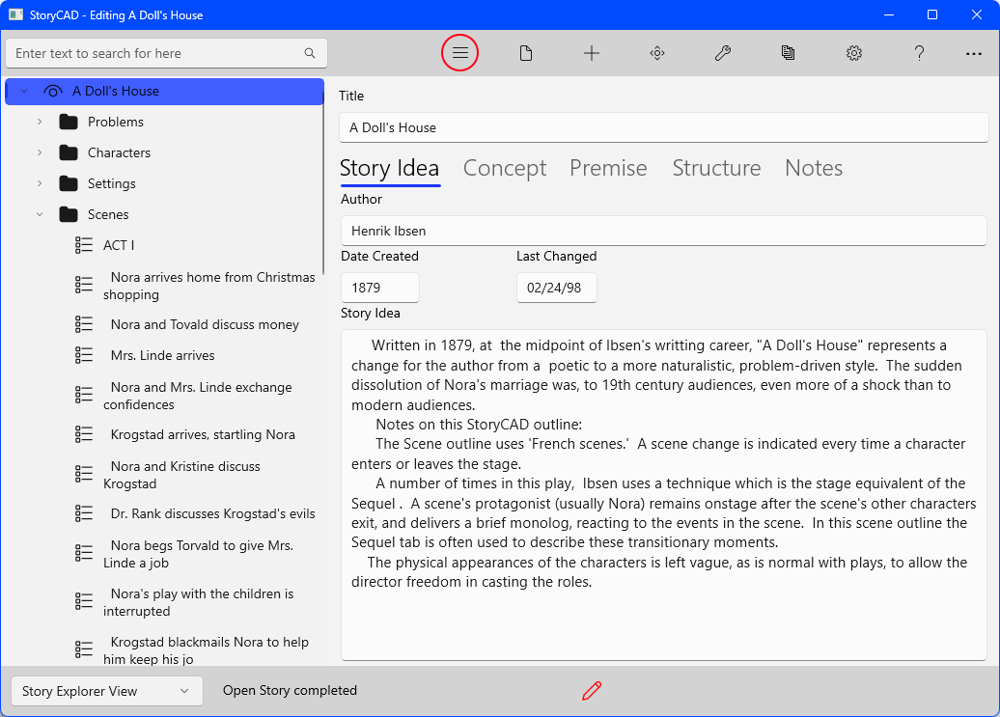
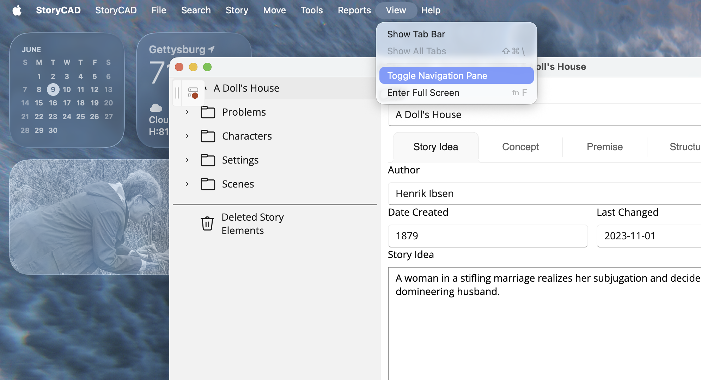

## Show/Hide Navigation Pane

This button toggles the Navigation Pane to either display or be hidden. Hiding the Navigation Pane makes better use of screen space on a smaller screens or when the main form is sized smaller. It also encourages focus on just the one screen.

(Hint: StoryCAD detects and reports spelling errors on most text fields.)

### macOS

On macOS, the same toggle is available in the native menu bar under **View > Toggle Navigation Pane**.

By default the in-window toolbar is also visible. To hide it and rely on the menu bar instead, open Preferences and turn off **Hide in-window toolbar** on the Other tab. The change takes effect on the next launch.
