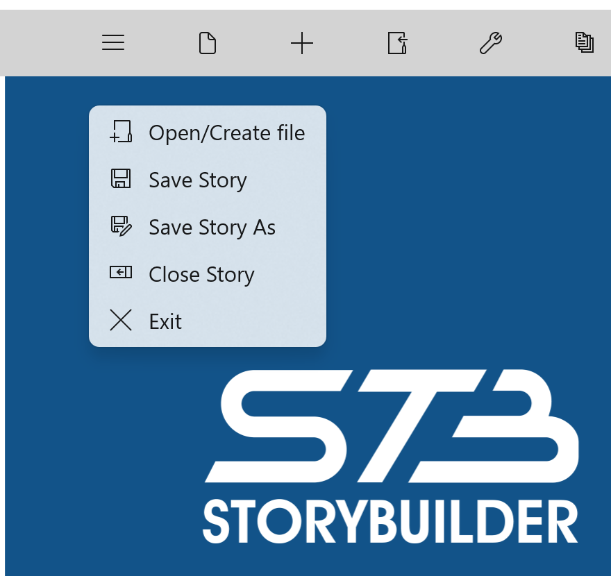
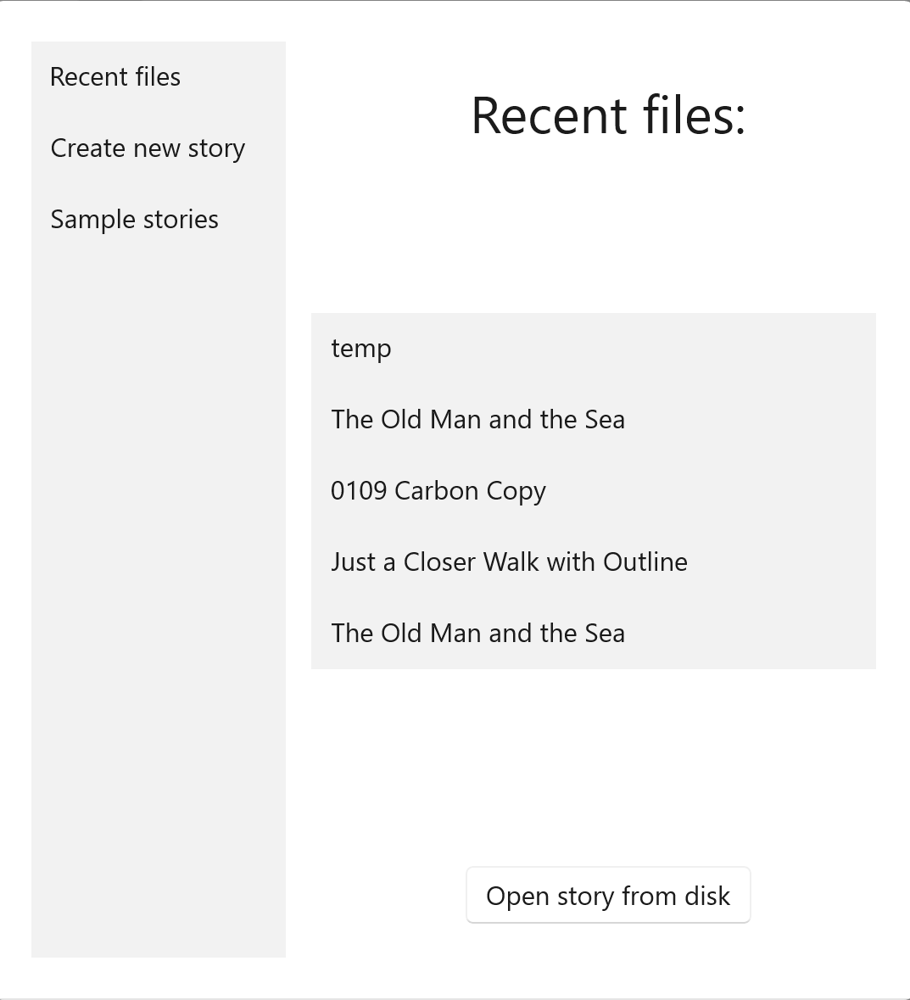
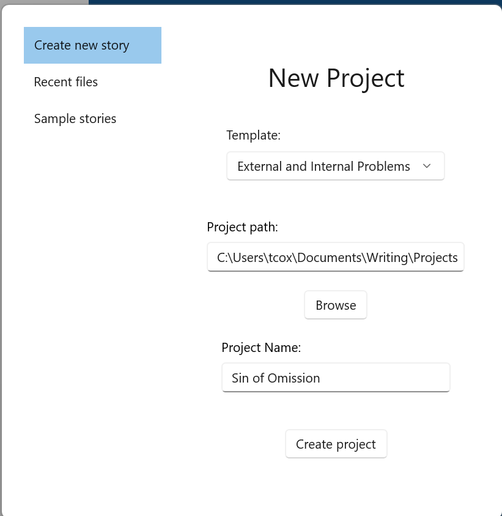

## Reading and Writing Outlines ##
Reading and Writing Outlines  

The File Menu button displays a drop-down menu of file options:  

A StoryCAD outline is a single file with a file extension of .stbx: for instance, ‘The Maltese Falcon.stbx.’   A StoryCAD file can be moved, copied, etc.  
   
The Open command identifies which outline you wish to work on. The Save command will save the file with the same name it with which it was opened or previously saved. The Save As command will save an outline under a new name or at a new location.   

File Open displays the following open dialog:  

This dialog will by default display recently opened outlines. Clicking on Open story from disk will open a file browser to allow you to pick a particular outline to pen.  Clicking on the Create new story tab on the left will display a dialog for a new story outline. The Project path defaults to the file folder specified in Preferences.  

   
Clicking on Sample Stories on the left tab displays a list of sample outlines installed with StoryCAD for you to play with. If you intend to change a sample, we recommend saving it to a different location before doing so.  

Only one story outline can be open at a time.  If you open a new file you'll be prompted to save the current file first if it’s been modified.  

   
[Previous - Starting and Stopping StoryCAD](Starting_and_Stopping_StoryCAD.md)   
[Next up - The StoryCAD User Interface](The_StoryCAD_User_Interface.md)
