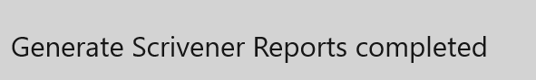
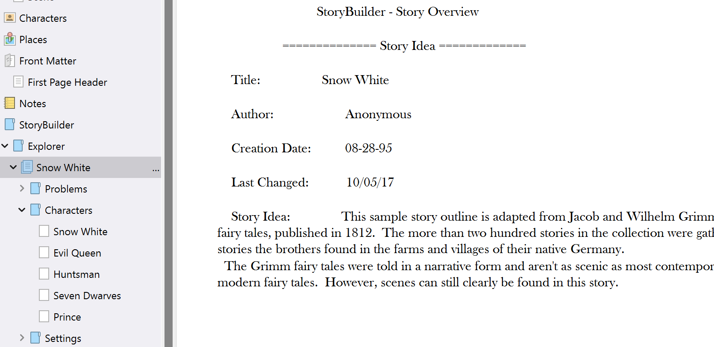

#### Reports ####
Reports  

Clicking on the Reports button on the Menu Bar displays a fly-out menu with two reporting options:  

Print Reports  

If you select the Print Reports option, a dialog will appear which allows you to check the particular reports you wish to print:  

Clicking Generate will cause all of the selected reports to print on your default printer.  

Scrivener Reports  

If you use Scrivener, clicking Scrivener Reports will open a file picker to allow you to select a Scrivener .scrivx file from a Scrivener project. The Scrivener project you select is the one you’ll be writing your draft in, and it must have been created before you generate the reports.  

A convenient way to use these embedded reports is to split your screen, with one pane open to a text node in the Manuscript and the other to a node in the outline:  

