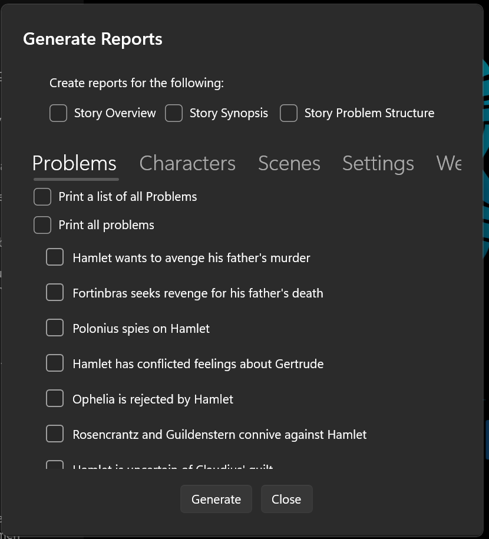
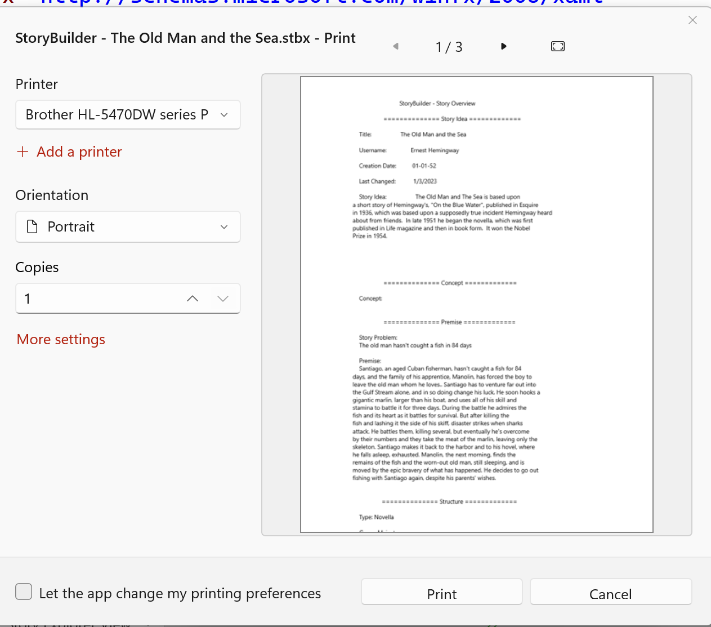

## Print Reports

If you select the Print Reports option, a dialog will appear which allows you to check the particular reports you wish to print:

The available report types include Story Overview, Problem, Character, Setting, Scene, Folder, Web, Notes, and Story World. Check the boxes for the story element types you want to include in your printed output.

On Windows 11 systems, StoryCAD provides a Print Manager which allows you to select a printer and its options, and to display reports in a Print Preview window:

If you’re running Windows 10, Clicking Generate will cause all of the selected reports to print on your default printer.

### Images appendix

If a Character, Setting, Scene, or Notes element you selected has pictures on its [Images tab](../Story%20Elements/Images_Tab.html), those pictures are added as an appendix at the end of the report. Each element gets a heading followed by its pictures and their captions, on fresh pages after the text. Clear the **Include Images Appendix** checkbox on the dialog to leave pictures out; it is checked by default. When none of the selected elements have pictures, the appendix is skipped.
