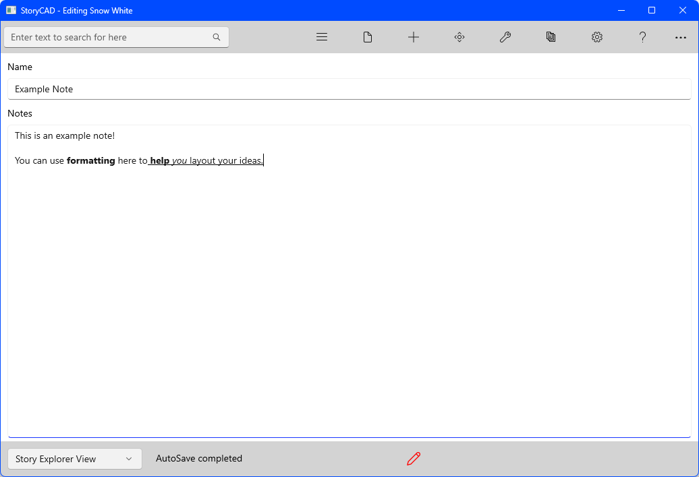

## Notes Form
Notes forms can store any information you wish anywhere in the outline. Most story elements include a Notes tab; however, you can add Notes forms for more in-depth research and store these anywhere within your outline.

Text editing capabilities differ by platform. Windows supports rich text formatting with a toolbar and spell checking, while macOS uses plain text only. See [Platform Differences](../Front%20Matter/Platform_Differences.html) for details.

