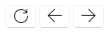

## Website Form
The website form allows you to store and view web pages easily and functions like a smaller version of your web browser. The form keeps the URL you're browsing.

These buttons allow you to refresh, go forwards and backward respectively.

This is the search bar. If you have a website link (URL) then you can paste it here and after clicking the search button it will load the website. Conversely if you don’t have a  URL, you can search a query such as a map of the world and it will search it using 
Google.

Example - Planning out a fictional character.

1) Create a new website node, you can do this by right clicking a node and then clicking the webpage icon (ALT + W).

2) Now navigate to it by clicking on it, it should now look similar the picture below.

3) Now let's make a fictional map, so search for "fictional map generator".

4) Select any website below, for this example we will use the first one.

We have now got a map of our fictional world and can start planning our story around it.

Note: The Website Form requires the Microsoft Edge WebView 2 runtime.  Most Windows computers will already have this installed by default however if you are for any reason missing it, StoryCAD will ask to install it for you.

