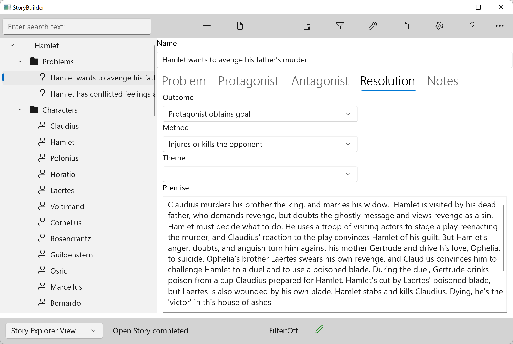

### Resolution Tab ###
Resolution Tab

The resolution is the outcome of the problem.  Not every problem in a story must be resolved, but the important ones which affect the protagonist's desire and show his growth must be.  If they are not, the reader, who has been turning pages to find out what happens, will feel cheated.

The resolution of a problem is more than what happens.  It also includes how the outcome came to be reached, and for the major story problems (especially inner problems which deal with character growth), what the story means--- the lessons learned.

