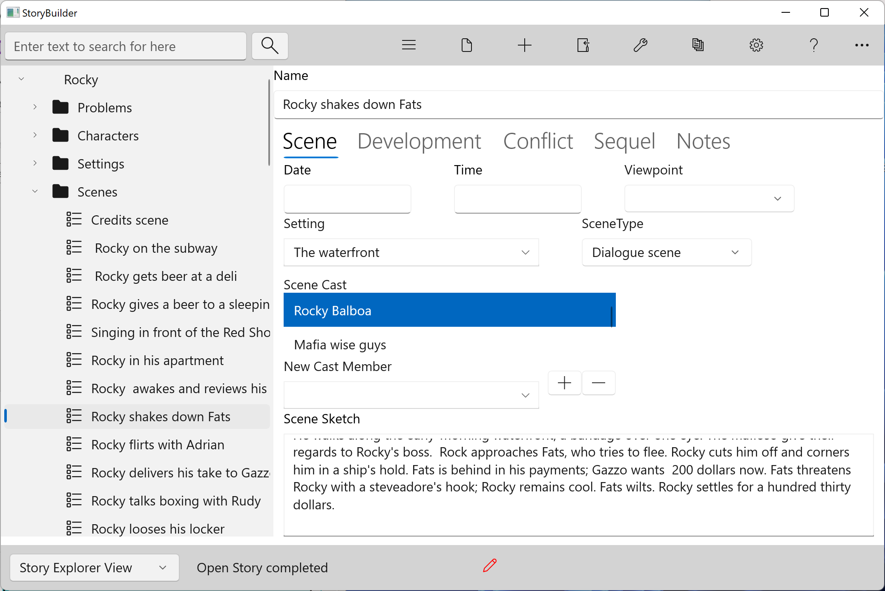

### Scene Tab ###
Scene Tab  

Date and Time&nbsp;&nbsp;&nbsp;&nbsp;&nbsp;&nbsp;&nbsp;&nbsp;Identify when the scene occurs.  

Viewpoint&nbsp;&nbsp;&nbsp;&nbsp;&nbsp;&nbsp;&nbsp;&nbsp;Viewpoint should generally not change within a single scene.  

Setting&nbsp;&nbsp;&nbsp;&nbsp;&nbsp;&nbsp;&nbsp;&nbsp;This control lists the settings defined on the Setting form.  Select one of the listed settings to provide a backdrop for the scene.  

Cast&nbsp;&nbsp;&nbsp;&nbsp;&nbsp;&nbsp;&nbsp;&nbsp;The number of characters in a scene should be limited to those who contribute to the scene's purpose and dramatic structure.  

Scene Sketch&nbsp;&nbsp;&nbsp;&nbsp;&nbsp;&nbsp;&nbsp;&nbsp;A thumbnail sketch of the scene.  

   
[Previous - Scene Form](Scene_Form.md)   
[Next up - Develpment Tab](Develpment_Tab.md)
