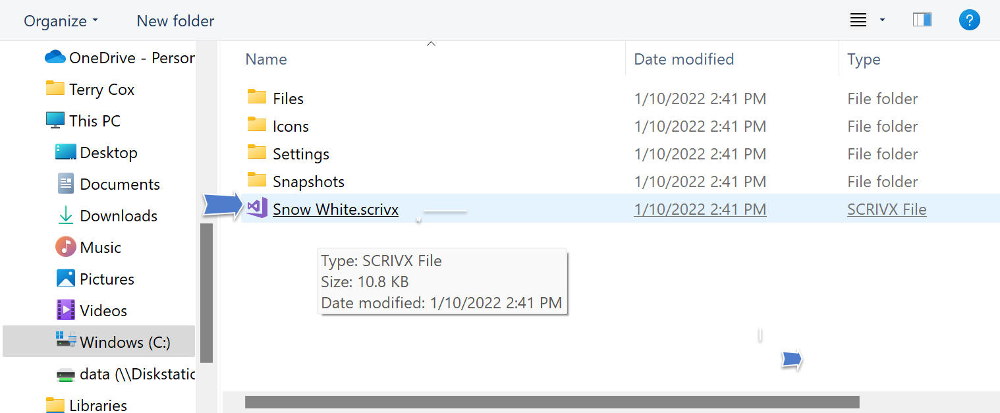
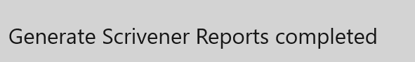

## Scrivener Reports ##
Scrivener Reports  

If you use Scrivener, clicking Scrivener Reports will open a file picker to allow you to select a Scrivener .scrivx file from a Scrivener project. The Scrivener project you select is the one you’ll be writing your draft in, and it must have been created before you generate the reports.  

You can open your Scrivener project. You’ll see a set of nodes added to the Binder, which contain your reports:  

A convenient way to use these embedded reports is to split your screen, with one pane open to a text node in the Manuscript and the other to a node in the outline:  

   
[Previous - Print Reports](Print_Reports.md)   
[Next up - Preferences](Preferences.md)
