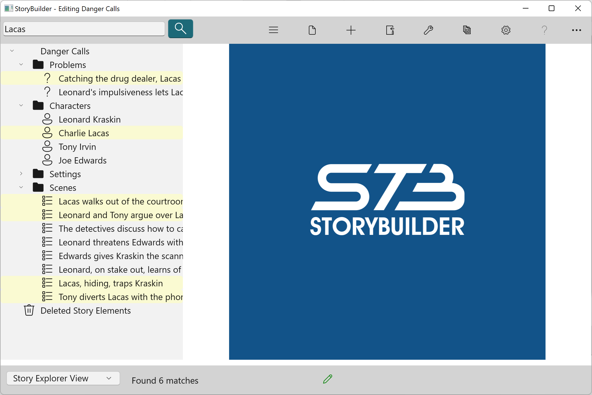

#### Search ####
Search  
StoryCAD contains a search field, located at the left on the Menu Bar, which will perform narrow searches of your outline for specific items. To use it, enter text to search for in the search field and click the search button (hourglass.) The story elements containing the search text in selected fields will be highlighted:  

To clear the search, click on the search button a second time.  

   
[Previous - Menu Bar](Menu_Bar.md)   
[Next up - Show/Hide Navigation Pane](Show_Hide_Navigation_Pane.md)
