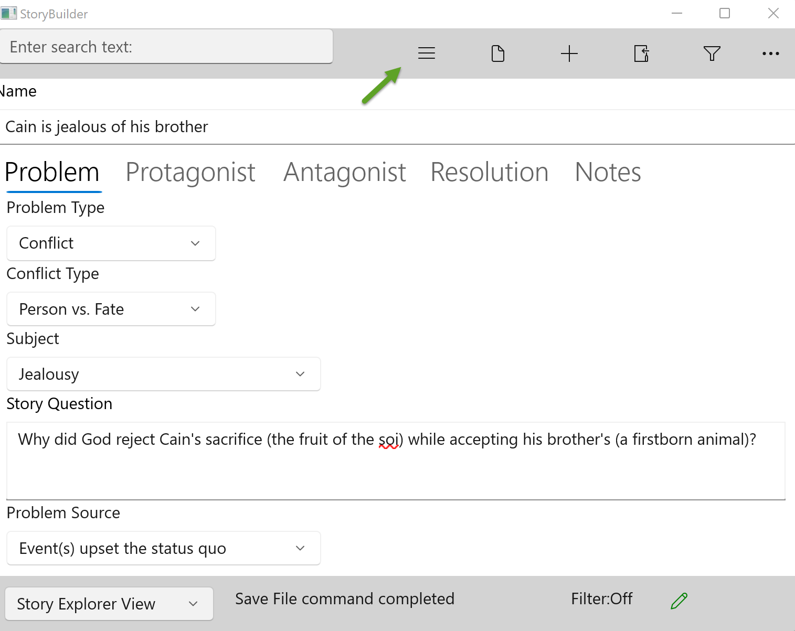

#### Show/Hide Navigation Pane ####
1  
Show/Hide Navigation Pane  

This button toggles the Navigation Pane to either display or be hidden. Hiding the Navigation Pane makes better use of screen space on a smaller screens or when the main form is sized smaller. It also encourages focus on just the one screen.  

(Hint: StoryCAD detects and reports spelling errors on most text fields.)  
