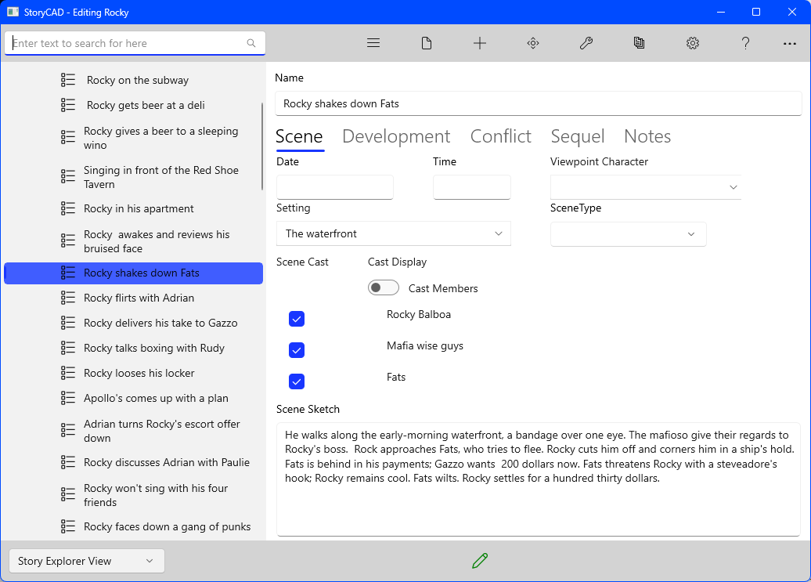

### Scene Tab

Date and Time		Identify when the scene occurs.

Viewpoint		Viewpoint should generally not change within a single scene.

Setting		This control lists the settings defined on the Setting form.  Select one of the listed settings to provide a backdrop for the scene.

Cast		The number of characters in a scene should be limited to those who contribute to the scene's purpose and dramatic structure.

Scene Sketch		A thumbnail sketch of the scene.

