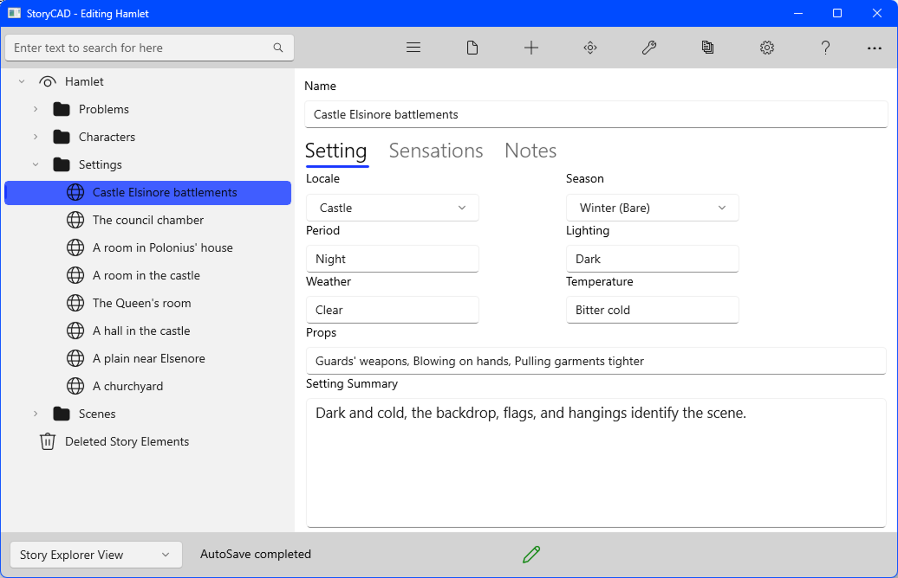

### Setting Tab
Setting Tab

The Setting tab contains elements which make the setting specific and unique.

 

Locale	The location of the setting in space.

Season	These locate the setting in time.
Period

Lighting	These help to define the setting as a source of mood and atmosphere
Weather
Temperature	

Props	These elements make the scene specific for the characters, and therefore for the reader. An ashtray that a character nervously rocks back and forth is a prop. Props give characters little things to do (‘business’, in stage 

If a setting is used in multiple scenes, but the significance of the setting changes, with a different atmosphere or props, you may want to create a separate outline entry for the new setting.

