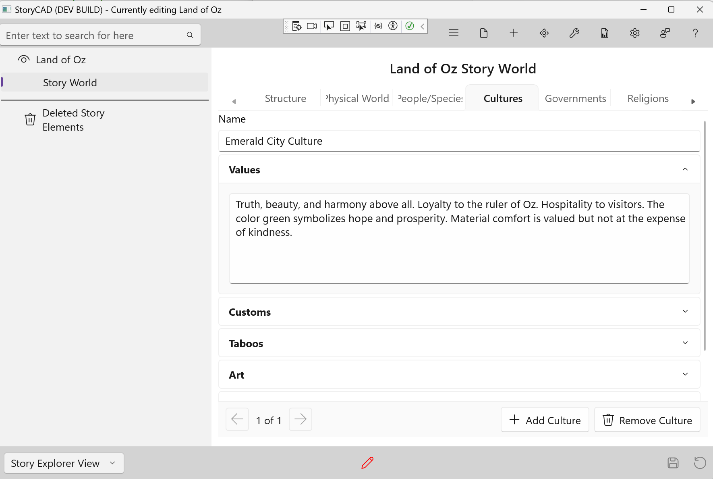

### Cultures Tab

The Cultures tab captures the social environments where your characters exist. This is a list-based tab—a world often has multiple cultures, each with its own values, customs, and way of life.

Every story has one or more milieus—the social environments that shape characters. Even "realistic" fiction requires understanding the specific culture you're portraying, whether it's a police precinct, a law firm, or a small Southern town.

#### Adding and Navigating Entries

- Click **+ Add Culture** to create a new entry
- Use the **Prev** and **Next** buttons to navigate between entries
- The position indicator shows your current location
- Click **Remove** to delete the current entry

#### Fields

**Name**
The identifier for this culture—"Emerald City Culture," "Wall Street," "The Wizarding World."

**Values**
What matters most to these people? Honor, family, wealth, knowledge, faith, survival? Core values drive behavior and create conflict when values clash.

**Customs**
How do they greet, marry, mourn, and celebrate? Customs make cultures distinctive and provide opportunities for characters to fit in or stand out.

**Taboos**
What is forbidden or shameful? Every culture has lines that aren't crossed. Taboos create tension and define boundaries.

**Art**
How do they express themselves aesthetically? Music, visual arts, architecture, literature. Art reveals what a culture values and celebrates.

**Daily Life**
Food, clothing, housing, and routines. The texture of everyday existence grounds your world in specific, memorable details.

**Entertainment**
Leisure, sports, games, and gatherings. How people play reveals what they value and how they relate to each other.

#### Tips

- Characters are shaped by their culture—and by how they accept or reject it
- Cultural differences create natural conflict and misunderstanding
- Small, specific details make cultures feel real
- Consider what happens when characters move between cultures
