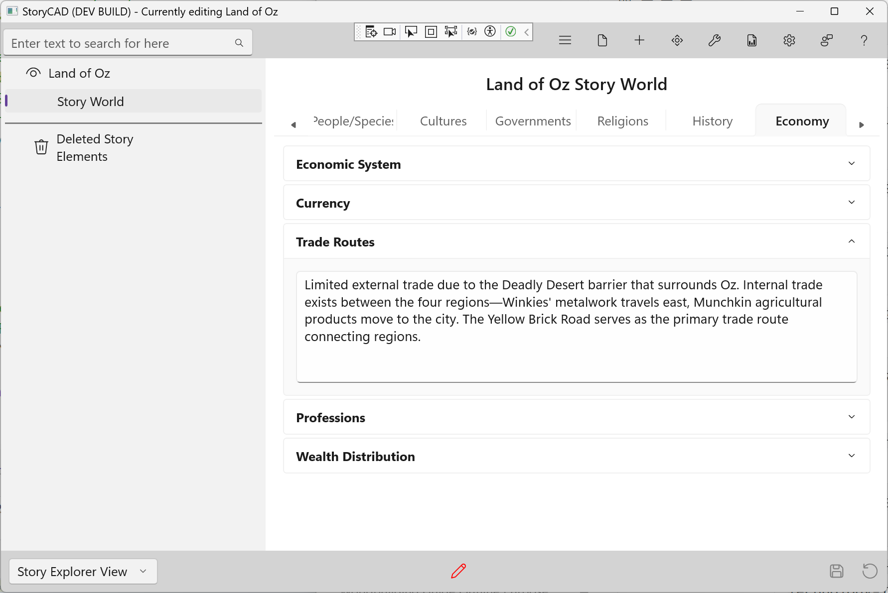

### Economy Tab

The Economy tab defines how resources, trade, and wealth work in your world. Economic systems affect what characters can do and what motivates them.

#### Fields

**Economic System**
How does the economy work? Capitalism, feudalism, barter, socialism, or something unique to your world. The system shapes opportunities and constraints for your characters.

**Currency**
What is the medium of exchange? Coins, paper money, digital credits, barter goods, or something exotic like souls or memories. Currency tells readers about what your world values.

**Trade Routes**
How do goods move through your world? Major trade routes create opportunities for travel, conflict, and cultural exchange. Disrupted trade can drive plots.

**Professions**
What work do people do? Common jobs, guilds, and career paths. Knowing the professions helps you populate your world with realistic characters.

**Wealth Distribution**
Who has resources and who doesn't? The gap between rich and poor, social mobility, and how wealth is accumulated. This shapes your characters' starting points and aspirations.

#### Tips

- Economic constraints create realistic obstacles for characters
- Trade routes can serve as story paths
- Professions help define secondary characters quickly
- Wealth distribution often drives conflict and motivation
