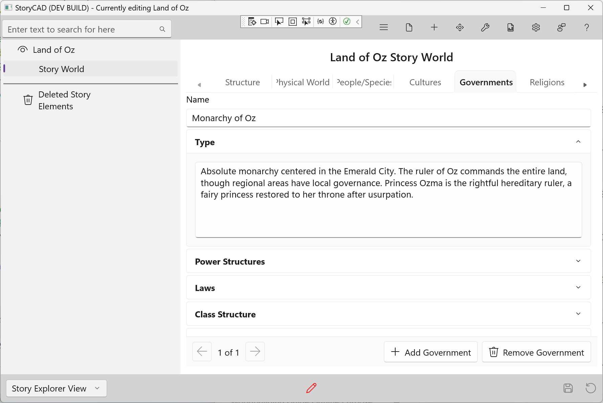

### Governments Tab

The Governments tab captures the political structures and power systems in your world. This is a list-based tab—create an entry for each significant government, faction, or power structure.

Government isn't just about nations. A corporation, a crime family, a religious order, or a school can all be "governments" with their own structures and rules.

#### Adding and Navigating Entries

- Click **+ Add Government** to create a new entry
- Use the **Prev** and **Next** buttons to navigate between entries
- The position indicator shows your current location
- Click **Remove** to delete the current entry

#### Fields

**Name**
The identifier for this government—"The Monarchy of Oz," "NYPD," "The Ministry of Magic."

**Type**
How is power organized? Monarchy, democracy, theocracy, oligarchy, corporation, or something unique. The type shapes how decisions are made and who has voice.

**Power Structures**
Who has power and how do they keep it? Formal hierarchies, informal influence, competing factions. Understanding power helps you write realistic political situations.

**Laws**
The legal system and how it's enforced. What's legal, what's illegal, and what are the consequences? Laws constrain characters and create plot opportunities.

**Class Structure**
Social hierarchy and mobility. Who's on top, who's on bottom, and can people move between levels? Class affects what characters can do and aspire to.

**Foreign Relations**
Alliances, enemies, and neutral parties. How does this government interact with others? Trade partners, rivals, vassals, and threats.

#### Tips

- Power dynamics affect every character interaction
- Laws and their enforcement create obstacles and opportunities
- Class structure shapes characters' starting points and goals
- Foreign relations can drive plots through war, diplomacy, or intrigue
