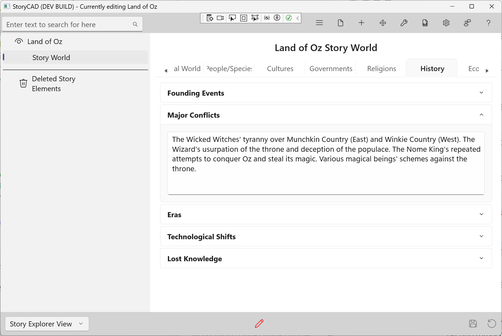

### History Tab

The History tab captures the past events that shaped your world into its current state. Focus on history that still affects your story's present.

#### Fields

**Founding Events**
How did the current order begin? Document the origin of nations, institutions, or the world itself. This might be a creation myth, a revolution, a founding, or a migration.

**Major Conflicts**
Wars, struggles, and revolutions that shaped the world. These events often explain current tensions, alliances, and hatreds between groups.

**Eras**
Major periods or ages in your world's history. Naming eras helps characters reference the past ("before the Fall," "during the Golden Age").

**Technological Shifts**
Changes in capability that transformed society. This could be the discovery of magic, the invention of printing, or the loss of advanced technology.

**Lost Knowledge**
What has been forgotten or destroyed? Lost knowledge creates mystery and can drive plots. Ancient secrets, forbidden arts, or technologies from a previous age.

#### Tips

- Focus on history that affects your current story—you don't need a complete timeline
- History explains *why* things are the way they are now
- Major conflicts often create the tensions your characters navigate
- Lost knowledge can be a powerful story driver
