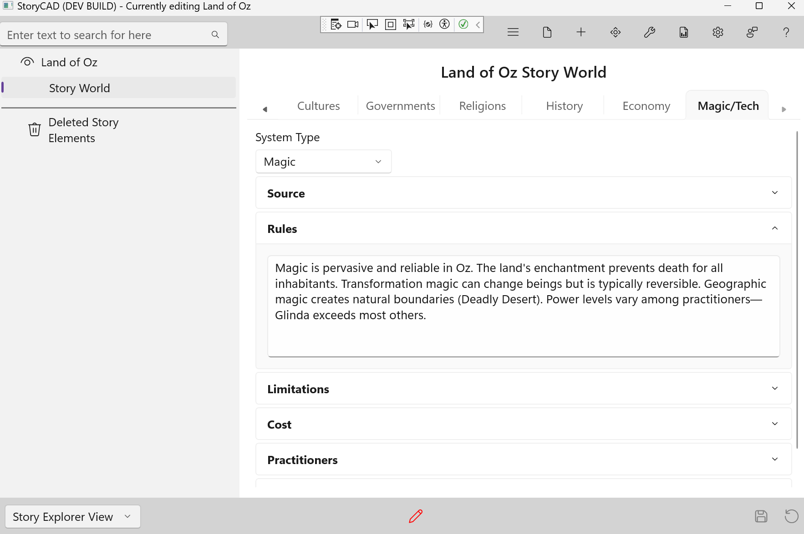

### Magic/Technology Tab

The Magic/Technology tab defines the power systems in your world—what's possible, what it costs, and who can use it. StoryCAD combines magic and technology because both are power systems with rules and costs.

As Arthur C. Clarke observed: "Any sufficiently advanced technology is indistinguishable from magic."

#### Fields

**System Type**
Is your world powered by Magic, Technology, Both, or Neither? This fundamental choice shapes everything else on this tab.

**Source**
Where does power come from? Divine gift, natural force, scientific principle, or learned skill. The source often determines who can access it.

**Rules**
How does the system work? Consistent rules make your world believable. Readers accept any rules you establish, but they notice when you break them.

**Limitations**
What can't this system do? The most interesting magic and technology have clear limits. Limitations create tension and prevent easy solutions.

**Cost**
What does using this power require? Energy, materials, health, sanity, moral compromise, or social standing. Cost creates stakes and consequences.

**Practitioners**
Who can use this power and why? Is it innate talent, learned skill, special equipment, or divine favor? Access to power shapes your world's social structure.

**Social Impact**
How does this power affect society? A world with healing magic has different hospitals. A world with teleportation has different cities. Think through the implications.

#### Tips

- Consistent rules matter more than detailed rules
- Limitations make power interesting—unlimited power is boring
- Cost creates meaningful choices for characters
- Social impact ripples through every aspect of your world
