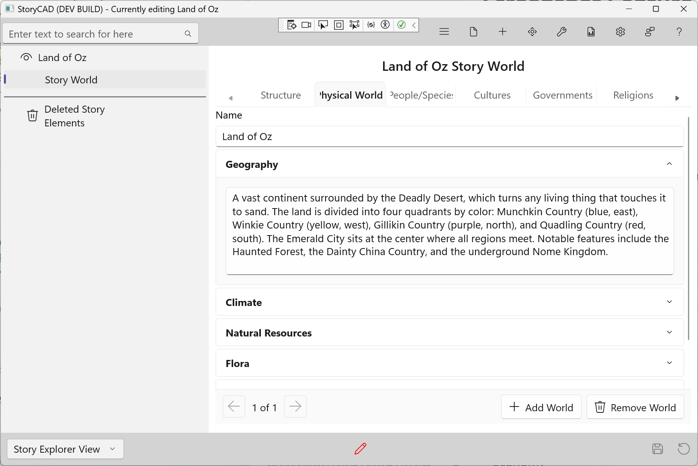

### Physical Worlds Tab

The Physical Worlds tab captures the geography, climate, and natural features of your world. This is a list-based tab—you can add multiple entries for stories with multiple worlds, planets, or realms.

For most stories, you'll create a single entry. For portal fantasies, space opera, or multiverse stories, create an entry for each distinct world.

#### Adding and Navigating Entries

- Click **+ Add World** to create a new entry
- Use the **Prev** and **Next** buttons to navigate between entries
- The position indicator (e.g., "2 of 5") shows your current location
- Click **Remove** to delete the current entry

#### Fields

**Name**
The identifier for this world—"Earth," "Middle-earth," "Mars," or "The Upside Down."

**Geography**
Terrain, landforms, and bodies of water. Mountains, rivers, deserts, and seas shape travel, settlement, and conflict. Consider how geography creates natural boundaries and routes.

**Climate**
Weather patterns, seasons, and temperature ranges. Climate affects daily life, agriculture, clothing, and architecture. Unusual climate can define a world.

**Natural Resources**
What's available and what's scarce? Resources drive economies, cause conflicts, and constrain what's possible. Consider minerals, water, food sources, and energy.

**Flora**
Plant life in your world. Familiar plants ground readers; unusual plants create wonder. Consider how plants affect food, medicine, materials, and hazards.

**Fauna**
Animal life in your world. Animals provide food, labor, companionship, and danger. Fantastic creatures can define a world's character.

**Astronomy**
Moons, stars, and celestial features. Multiple moons affect tides and calendars. Visible galaxies or strange skies remind readers they're not on Earth.

#### Tips

- Geography shapes civilization—consider how terrain affects your cultures
- Specific details make settings memorable (not "a forest" but "ancient oaks draped in moss")
- Scarce resources create conflict; abundant resources shape economies
- For single-world stories, one detailed entry is better than multiple sparse ones
