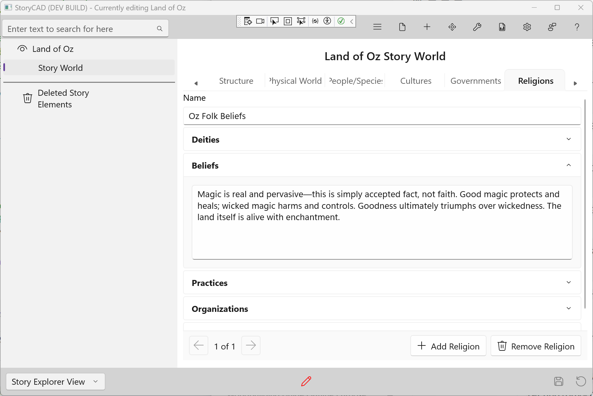

### Religions Tab

The Religions tab captures the belief systems and spiritual practices in your world. This is a list-based tab—many worlds have multiple religions or belief systems.

Even secular worlds have belief systems—philosophies, ideologies, or shared assumptions about how the world works. What people believe shapes how they act.

#### Adding and Navigating Entries

- Click **+ Add Religion** to create a new entry
- Use the **Prev** and **Next** buttons to navigate between entries
- The position indicator shows your current location
- Click **Remove** to delete the current entry

#### Fields

**Name**
The identifier for this religion—"Oz Folk Beliefs," "The Faith of the Seven," "Catholicism."

**Deities**
Gods, spirits, or higher powers (if any). Who or what do believers worship or revere? Deities can be active characters or distant concepts.

**Beliefs**
Core beliefs about existence, purpose, and the afterlife. What do adherents believe about how the world works and what happens after death?

**Practices**
Rituals, worship, and observances. How do believers express their faith? Regular practices, holy days, and life-marking ceremonies.

**Organizations**
Churches, temples, clergy, and hierarchies. How is the religion structured? Who speaks for the faith and who enforces its rules?

**Creation Myths**
How the world began (according to this religion). Creation myths reveal what a culture values and explain its place in the cosmos.

#### Tips

- Religion shapes morality, holidays, architecture, and daily routines
- Competing religions create natural conflict
- True believers and skeptics within a religion add complexity
- Consider how religion interacts with government and magic
