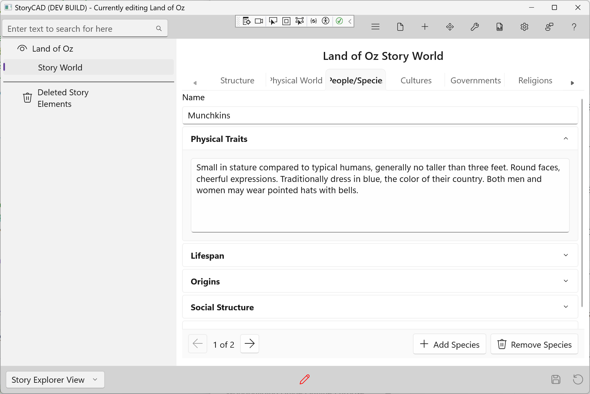

### People/Species Tab

The People/Species tab captures the inhabitants of your world. This is a list-based tab—create an entry for each distinct people, species, or group that plays a significant role in your story.

For fantasy and science fiction, this might be elves, dwarves, or aliens. For realistic fiction, think of this as distinct communities or subcultures—police officers, Wall Street traders, or small-town farmers.

#### Adding and Navigating Entries

- Click **+ Add Species** to create a new entry
- Use the **Prev** and **Next** buttons to navigate between entries
- The position indicator shows your current location
- Click **Remove** to delete the current entry

#### Fields

**Name**
The identifier for this group—"Elves," "Munchkins," "The Winkies," or "NYPD Detectives."

**Physical Traits**
Appearance and physical abilities. What do members of this group look like? Are there distinctive features that set them apart?

**Lifespan**
How long do they live? Lifespan affects culture, planning, and relationships. Immortal beings think differently than those with short lives.

**Origins**
Where did this group come from? Creation myths, evolutionary history, or migration stories. Origins often explain current traits and attitudes.

**Social Structure**
How do they organize themselves? Hierarchies, family structures, leadership patterns. Social structure shapes individual characters' options and constraints.

**Diversity**
Variation within the group. No group is monolithic—what subgroups, factions, or individual differences exist? Diversity prevents stereotyping.

#### Tips

- Even fantastic species should have internal logic and consistency
- For realistic fiction, "species" can mean professions, communities, or subcultures
- Diversity within groups makes them feel real
- Consider how different groups interact and perceive each other
