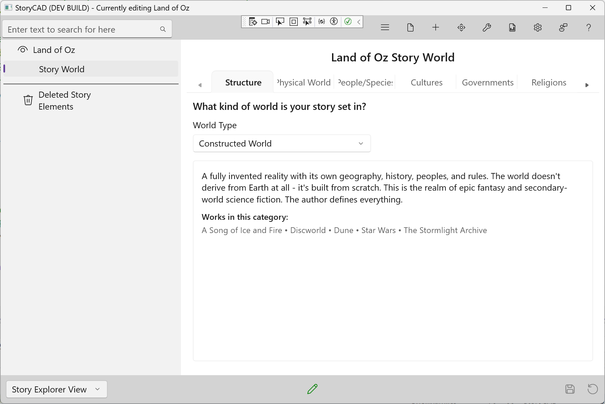

### Structure Tab

The Structure tab defines what kind of world your story is set in. This fundamental choice guides your worldbuilding approach.

#### World Type

Select the World Type that best describes your story's relationship to reality:

| World Type | Description | Examples |
|------------|-------------|----------|
| **Consensus Reality** | Our world as we know it | Mysteries, legal thrillers, literary fiction |
| **Enchanted Reality** | Our world with a touch of magic or wonder | Magical realism |
| **Hidden World** | Magic or supernatural hidden within our world | Harry Potter, Dresden Files |
| **Divergent World** | Our world with one key historical change | Alternate history |
| **Constructed World** | An entirely invented world | Lord of the Rings, Dune |
| **Mythic World** | A world of legend, prophecy, and fate | Classical mythology, epic fantasy |
| **Estranged World** | A familiar world made strange | Dystopian fiction, Kafka |
| **Broken World** | Post-apocalyptic or collapsed civilization | The Road, Hunger Games |

When you select a World Type, StoryWorld displays a description and example works to help confirm your choice.

#### Why World Type Matters

Your World Type selection helps you focus your worldbuilding effort:
- **Consensus Reality** stories need research into real-world settings and subcultures
- **Hidden World** stories need rules for how magic stays hidden
- **Constructed World** stories need comprehensive worldbuilding across all tabs
- **Broken World** stories need to define what collapsed and what remains

#### Tips

- If your story doesn't fit neatly into one category, choose the closest match
- You can always change the World Type as your story develops
- The World Type guides your thinking—it doesn't limit what you can create
