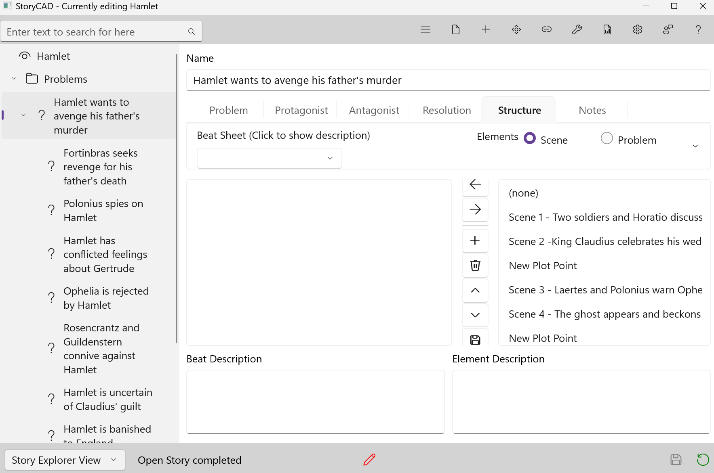

## Structure Tab

The Problem form's Structure tab helps you organize your story's plot using **beat sheets** -- structured templates that break a story into key moments called "beats." Each beat represents a pivotal moment or event that drives your narrative forward.

You assign scenes and sub-problems to beats, building a structural map of how your story unfolds.

### Why Beat Sheets Matter

Plot is the sequence of events that make up your story. Those events unfold in scenes, but where do your scenes come from, and how do they connect to each other? Beat sheets answer these questions.

A problem consists of a character's goal, motivation, and conflict. Your characters' efforts to resolve their problems are the events you describe in scenes. The Structure tab is where you relate those scenes (and sub-problems) to the beats in a beat sheet, giving your plot a deliberate shape.

### The Story Problem

Your outline can contain many problems -- complications, subplots, sequences -- but only one is the **Story Problem**. You identify the Story Problem on the Story Overview form's Premise tab. It is the spine of your story; when it is resolved, your story is over.

We recommend starting with the Story Problem's Structure tab before working on sub-problems.

### Choosing a Beat Sheet

Open the Structure tab on any Problem element and select a beat sheet from the dropdown. StoryCAD includes several popular templates:

- **Save the Cat** (15 beats)
- **Hero's Journey**
- **Seven Point Story Structure**
- And others

When you select a template, its beats load into the left list. Each beat has a title and a description explaining what that moment in the story should accomplish.

**Tip:** Use a full-featured beat sheet (like Save the Cat) for your Story Problem. For sub-problems, simpler beat sheets work better -- think of them as "mini" beat sheets that keep subplots focused without overcomplicating the structure.

### Assigning Elements to Beats

The Structure tab has two lists side by side:

- **Left list (Beats):** The beats from your chosen beat sheet.
- **Right list (Elements):** Your outline's scenes or problems, toggled by the Scene/Problem radio buttons above the list.

To assign an element to a beat:

1. Select a beat in the left list.
2. Use the radio buttons to show either scenes or problems in the right list.
3. Select the element you want to assign.
4. Click the **Assign** button (left chevron) between the two lists.

The beat now shows the assigned element's name and icon. To remove an assignment, select the beat and click the **Unassign** button (right chevron).

**Comparing descriptions:** The bottom of the tab shows two description panels side by side. The left panel displays the selected beat's description (what this moment in the story needs). The right panel displays the selected element's description (what the scene or problem contains). Compare the two to decide whether the assignment makes sense.

### Button Reference

Seven buttons sit between the two lists. Each button displays a tooltip when you hover over it:

| Button | Icon | What it does |
|--------|------|--------------|
| Assign | Left chevron | Assign the selected element to the selected beat |
| Unassign | Right chevron | Remove the assignment from the selected beat |
| Add | Plus sign | Add a new beat to the beat sheet |
| Delete | Trash can | Delete the selected beat (asks for confirmation) |
| Move Up | Up arrow | Move the selected beat up in the list |
| Move Down | Down arrow | Move the selected beat down in the list |
| Save | Floppy disk | Save the current beat sheet to a file for reuse |

### Editing Beats

Every beat sheet is an editable starting point. When you load Save the Cat, you get its 15 standard beats, but you can reshape the template to fit your story:

- **Add** new beats to fill gaps the template does not cover.
- **Delete** beats that do not apply to your story. A confirmation dialog appears to prevent accidental loss.
- **Rename** beats by editing their title and description directly.
- **Reorder** beats using the Move Up and Move Down buttons to match your story's flow.
- **Save** your modified beat sheet to a file so you can reuse it on other projects.

The original template is never modified. Selecting Save the Cat from the dropdown again restores the original beats -- but be aware that reloading a template clears all your existing beat assignments for that problem.

### Beat Sheet Rules

Keep these guidelines in mind as you work:

- **Scenes can appear in multiple beats.** A scene can and should accomplish more than one thing (see the Purpose of Scene on the Scene form's Development tab). You can also assign a scene to beats on different problems, tying those problems together.

- **Sub-problems can only appear once.** You can assign a sub-problem to one beat in one parent problem. When you assign a sub-problem, you are making a promise to yourself to plot that problem into scenes as well, using its own Structure tab.

- **Not every beat needs to be filled.** When reviewing your outline, you may find that a plot hole corresponds to a beat you left empty. Beat sheets also help diagnose other plotting issues: lack of structure, pacing problems, weak character arcs, subplot integration, and weak endings.

- **A beat sheet is a pattern, not a cage.** Once you choose a beat sheet, you are shaping an aspect of your story's structure. Edit the beats freely to make the template serve your story rather than the other way around.

### Reports

The Generate Reports dialog includes a **Story Problem Structure** checkbox. When selected, it produces three reports:

- **Recursive Structure Report:** Walks through the Story Problem's beat sheet, then recurses into every sub-problem's beat sheet, showing the full hierarchy of your plot.

- **Plot Structure Diagram:** A problems-only tree showing how sub-problems connect through beat sheets, starting from the Story Problem. Scenes are excluded -- this is purely the structural skeleton of your plot. Use it to see the big picture of how subplots and complications relate to the main story.

- **Unassigned Elements:** Lists problems and scenes that are not assigned to any beat sheet. Use this to find "orphan" story elements that may have been forgotten or need to be integrated into your plot structure.

If you have not set a Story Problem on the Story Overview form, these reports will be blank.

### Tips

- **Start at the top.** Work on the Story Problem's beat sheet first, then drill into sub-problems.
- **Use the descriptions.** Read the beat description and the element description side by side before assigning. If they do not match well, that is useful information about your story.
- **Save custom beat sheets.** If you modify a template in a way you like, save it. You will thank yourself on the next project.
- **Review empty beats.** An empty beat is not necessarily a problem, but it is worth asking why. The answer might reveal a gap in your story -- or confirm that your story genuinely does not need that beat.
- **Check the Unassigned Elements report.** After building out your beat sheets, run this report to catch any scenes or problems that slipped through the cracks.
