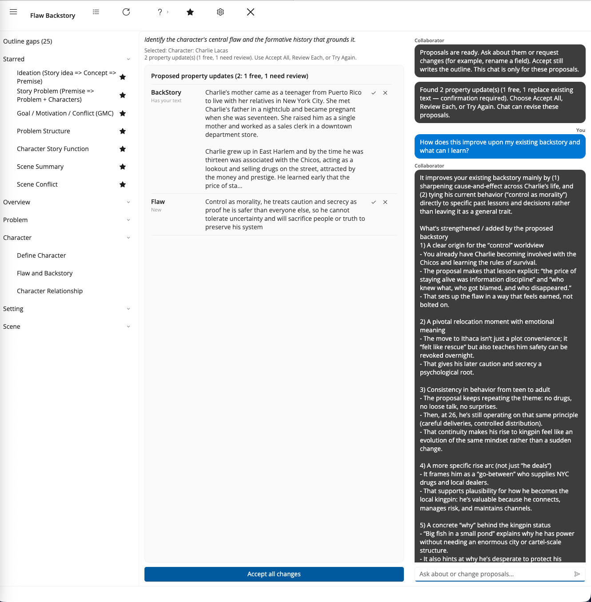

# Chat

The right-hand column of the Story Collaborator window is the chat. While a workflow runs, Collaborator posts its progress there, and when the run finishes it posts a status line saying what finished and how many updates are waiting. Once a run has finished, you can also type into the column and ask about what you have just been shown.

## What chat is good for

Chat is for exploring a result before you decide about it. You might ask for three tighter versions of a proposed premise, ask why Collaborator chose a particular goal for the antagonist, or ask it to make a conflict more personal and less abstract. The answers come back in the chat column, and they can change your mind about which proposals to accept.

What chat cannot do is put text into your outline. A chat answer, however good, stays in the column. If you want it in a field, either run the workflow again so that it proposes the new wording as a Property Update, or copy the wording into StoryCAD yourself. This is deliberate: the Property Updates list, with its labels and its Accept and Skip choices, is the one path by which Collaborator writes to your outline, and keeping chat outside that path means a conversation can never change a field you did not mean to change.

## When to use a workflow instead

A workflow knows which fields belong to which story element and proposes text for them in a form you can accept row by row, so when you want several named fields filled on a form, run the workflow. When you want one rephrasing or an explanation, ask in chat. When you want the same workflow's result done over, use Try Again on the top bar rather than asking chat to redo it. Chat is the freer of the two and the less structured; use both, but do not expect chat alone to rebuild your outline.
