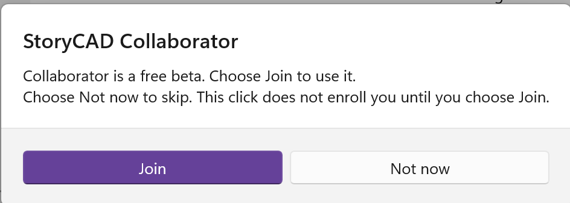
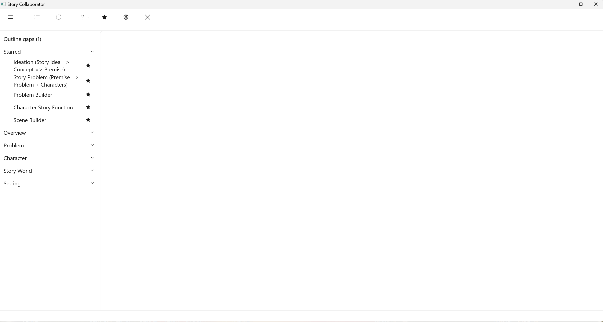

# Getting Started

This page is how Collaborator is switched on. During the invited beta you Join from a dialog. After Collaborator is for sale, the same toolbar button offers a paid subscription. Once it is running, [Opening Collaborator](Opening_Collaborator.html) describes the window and [Running a Workflow](Running_a_Workflow.html) walks through your first run.

The Join dialog and the Subscribe dialog both link here. Read this page before you choose Join or Subscribe.

## About the beta

StoryCAD Collaborator is in an invited beta. The people using it are writers, teachers, and students the StoryBuilder Foundation has asked to try it and say where it helps and where it does not, and the beta ends when that feedback says the product is ready, not on a date. During the beta you do not buy anything. There is no subscription to start, no trial to keep track of, and no card to enter; the Foundation pays for the AI service behind every workflow you run. Beta testers use Collaborator under the same usage limits as any future subscriber, so a heavy week can run into the limit, and the section below on running out of credits explains what to do then. This manual does not discuss pricing.

## What you need

You need StoryCAD 4.3 or later. Collaborator is part of that app; there is nothing separate to download. You also need a story outline to work on, since Collaborator works on the outline you have open, and a working network connection, because every workflow runs against a service.

## Turn it on during the beta

Clicking **Collaborator** on the toolbar does not enroll you. StoryCAD shows a dialog titled StoryCAD Collaborator, with **Join**, **Not now**, and a link to this page.

1. Open or create an outline.
2. Click **Collaborator** on the toolbar.
3. Read this page if you want more than the dialog says.
4. Choose **Not now** to skip. Collaborator stays closed. Click Collaborator later and the same dialog returns.
5. Choose **Join** to enroll. Collaborator opens in its own Story Collaborator window. You do not type a code, and you do not wait for an email.

If the beta is full or closed, Join is not offered. Collaborator is not for sale during the beta, so do not look for a store purchase as a substitute.

## Turn it on after Collaborator is for sale

When Collaborator is sold as a subscription, the toolbar button shows **Subscribe**, **Restore purchases**, and **Not now**, plus a link to this page, Terms of Use, and Privacy Policy. The store sets the price. This manual does not invent one.

1. Open or create an outline.
2. Click **Collaborator** on the toolbar.
3. Choose a plan if more than one is listed.
4. **Subscribe** opens the Microsoft Store or Mac App Store payment sheet. Pay there, not inside StoryCAD.
5. **Restore purchases** if you already paid on this store account.
6. **Not now** leaves Collaborator closed.

If you Joined the beta earlier, you can keep using Collaborator without buying until the Foundation says that path has ended.

## If Collaborator does not open

**Not now** is supposed to leave it closed. A message that enrollment is unreachable means StoryCAD could not reach the Foundation's service; wait a few minutes and try again. If the Story Collaborator window still never opens after Join or after a completed purchase, restart StoryCAD. For StoryCAD help in general, see [Getting Help](../Front%20Matter/Getting_Help.html).

## If you run out of credits

During the beta, workflow runs are paid for from a credit allowance the Foundation grants to each tester. If you use it up before it renews, a run will stop and tell you to contact StoryBuilder Foundation. Do not buy credits in the store. Tell the Foundation instead, and say roughly what you were doing; heavy use is useful information for the beta, and your allowance can be topped up.

After Collaborator is for sale, a subscriber who runs out can buy more from Collaborator's Buy Credits screen, or wait for the next monthly renewal.

## Preferences that affect the manual

StoryCAD opens either the production or the beta user manual from Help, depending on the Use beta documentation preference, and Collaborator's own Help points at the same manual. Beta builds turn that preference on, and you should leave it on for the length of the beta: this Collaborator section exists only in the beta manual until the product ships, so switching to the production manual would make the Help links land on a page that is not there.

## Check that it works

Open an outline that has at least a short Story Idea on the Overview, launch Collaborator, and select a simple workflow such as Ideation (Story idea => Concept => Premise). When suggestions appear, you are set. Read [Reviewing Suggestions](Reviewing_Suggestions.html) before you accept anything you care about.

## Next

- [What Collaborator Is](What_Collaborator_Is.html), how it fits craft and StoryCAD
- [Opening Collaborator](Opening_Collaborator.html), the three-pane window
- [An Example Session](Tutorial/An_Example_Session.html), a short walkthrough
