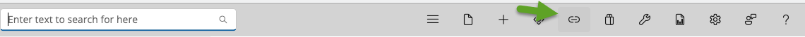
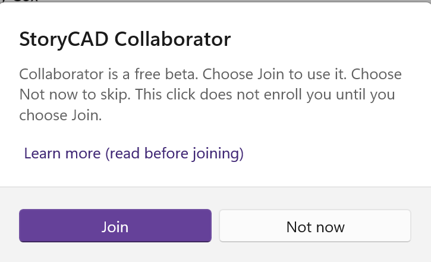

# Getting Started

This page explains how you activate StoryCAD Collaborator. Collaborator is available from both the Microsoft Windows and Apple Macintosh versions of StoryCAD.

All you need to run Collaborator is StoryCAD Release 4.3 or later. Collaborator is part of StoryCAD; there is nothing separate to download. Collaborator sessions work on the outline you have open, and you will also need a working network connection, because every Collaborator workflow runs against a Cloudflare service which connects to AI models. The beta is free; we'll pay for the AI use.  

The **Join the beta** dialog and the **Subscribe** dialog both bring you to this page. We urge you to read and explore the StoryCAD Collaborator documentation before you choose to enroll or subscribe. Once you're running, [Opening Collaborator](Opening_Collaborator.html) describes the Collaborator interface, and [Running a Workflow](Running_a_Workflow.html) walks you through your first session. There are descriptions of each workflow and a tutorial. 

Right now, StoryCAD Collaborator is a capped open beta. What we mean by 'open beta' is that you can volunteer to test Collaborator without special invitations or setup procedures.  This page will show you how to do that; it's super easy.  'Capped' means that we're limiting the number of people allowed in the beta. We enroll participants on a first-come, first-served basis.  Once we reach the cap, we will deny new attempts to enroll. The beta ends when beta testers' feedback says the product is ready, not on a specific date.

 During the beta you do not buy anything. There is no subscription to start, no trial to keep track of, and no credit card to enter; the Foundation pays for the AI service behind every workflow you run. Beta testers use Collaborator under the same usage limits as any future subscriber, so a heavy week can run into the limit, and the section on running out of credits explains what to do then (during the beta, that won't cost you, either.) 

## Paid subscriptions

After the beta test period ends, Collaborator becomes a paid subscription. You subscribe from the Microsoft Store on Windows or the Mac App Store on a Mac. StoryCAD does not take a card number. The store from which you downloaded StoryCAD sells the subscription, sets the price, and renews it until you cancel. This manual doesn't discuss pricing for the production service. We think you'll find it's not only inexpensive but a bargain.

On Windows, **Subscribe** opens the Microsoft Store payment sheet for the Microsoft account signed into that PC. You can cancel later in that account's subscription settings. **Restore purchases** brings the subscription back on another Windows PC that uses the same Microsoft account.

On a Mac, **Subscribe** opens the Mac App Store payment sheet for the Apple ID signed into that Mac. You can cancel later in that Apple ID's subscription settings. **Restore purchases** brings the subscription back on another Mac that uses the same Apple ID.

A Microsoft Store purchase does not restore on a Mac, and a Mac App Store purchase does not restore on Windows. 

## How to join the beta

Clicking **Collaborator** on the toolbar does not enroll you. StoryCAD shows a dialog titled StoryCAD Collaborator, with **Join**, **Not now**, and a link to this page. Here's how it works:

1. Open or create an outline.

2. Click **Collaborator** on the toolbar:

   

3. The following dialog displays: 

   

   

   Read this (StoryCAD Collaborator) section of the user manual to learn more about Collaborator.

4. Choose **Not now** to skip. Collaborator stays closed. Click Collaborator later and the same dialog returns.

5. Choose **Join** to enroll. Collaborator opens in its own Story Collaborator window. You do not type a code, and you do not wait for an email. If the beta hasn't reached its cap limit, you'll be enrolled and will see the Collaborator window.

What appears in the window depends on the outline you opened at launch, and the topics below provide an explanation. If the beta is full or closed, the Join feature is not available.

## Activating Collaborator after it's for sale

When Collaborator is available as a paid subscription, the toolbar button shows **Subscribe**, **Restore purchases**, and **Not now**, plus links to this page, Terms of Use, and Privacy Policy. The store links show the price. Analyzing the beta will help us set that price. This manual does not invent one. 

To subscribe, you:

1. Open or create an outline.
2. Click **Collaborator** on the toolbar.
3. Choose a plan if more than one is listed.
4. **Subscribe** opens the Microsoft Store or Mac App Store payment sheet. Pay there, not inside StoryCAD.
5. **Restore purchases** if you have already paid on this store account.
6. **Not now** leaves Collaborator closed.

If you joined the beta earlier, you can keep using Collaborator without buying until the Foundation says that path has ended.

## If Collaborator does not open

**Not now** will not launch Collaborator, but won’t block it from trying another time. A message that enrollment is unreachable means StoryCAD could not reach the Foundation's service; wait a few minutes and try again. If the Story Collaborator window still never opens after **Join** or after a completed purchase, restart StoryCAD. For StoryCAD help see [Getting Help](../Front%20Matter/Getting_Help.html).

## If you run out of credits

During the beta, the Foundation grants each tester a credit allowance to pay for workflow runs. If you use it up before it renews, a run will stop and tell you to contact the StoryBuilder Foundation. Do not buy credits in the store. Contact us instead and say roughly what you were doing; heavy use is useful information for the beta and your allowance can be reset.

After Collaborator is for sale, a subscriber who runs out can buy more from Collaborator's Buy Credits screen, or wait for the next monthly renewal.

## Preferences that affect the manual

StoryCAD opens either the production or the beta user manual from Help, depending on the Use beta documentation preference, and Collaborator's own Help points at the same manual. Beta users turn that preference on, and you should leave it on for the length of the beta: the latest changes will exist only in the beta manual until a new release ships.

## Check that it works

Open an outline that has at least a short story idea on the Overview, launch Collaborator, and select a simple workflow such as Ideation (Story idea => Concept => Premise). You are set once suggestions appear. Read [Reviewing Suggestions](Reviewing_Suggestions.html) before you accept anything you care about.

## Next

- [What Collaborator Is](What_Collaborator_Is.html), how it fits craft and StoryCAD
- [Opening Collaborator](Opening_Collaborator.html), the three-pane window
- [An Example Session](Tutorial/An_Example_Session.html), a short walkthrough
