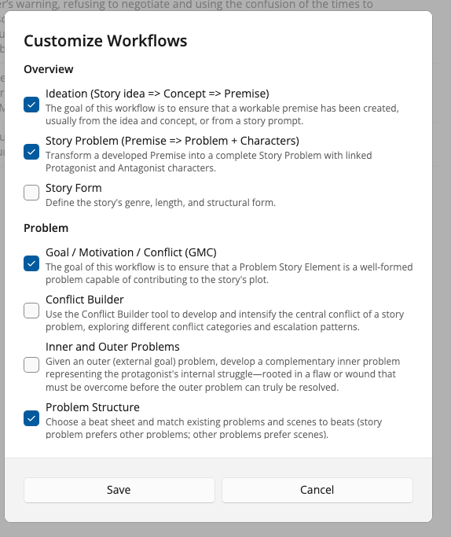

# Opening Collaborator

## Before you start

Install StoryCAD and Collaborator, and complete first-time setup, as described in [Getting Started](Getting_Started.html). Open a story outline in StoryCAD. Collaborator works on the outline you have open. Save your work in StoryCAD before long sessions if you are the cautious type.

## Launch Collaborator

With an outline open, start Collaborator from StoryCAD’s Collaborator command (toolbar or menu, depending on your build). A separate **Story Collaborator** window opens.

If Collaborator does not appear, return to [Getting Started](Getting_Started.html) and confirm install and activation.

## The Collaborator window

The window has three main areas:

| Area | What it is for |
|------|----------------|
| **Left** | Workflows. Pick one to run. |
| **Center** | Purpose of the current workflow, and **Property Updates** (suggested field changes) after a run. |
| **Right** | Chat: status messages and optional questions after a run. |

Across the **top**, from the left: show or hide the workflow list, the name of the workflow you are on, Review Each, Try Again, Help, Customize Workflows, Settings, and Exit. Review Each and Try Again stay greyed until a run leaves suggestions waiting. The bar is icons only, so hover one to read its name.

**Accept all changes** is not on the top bar. It sits at the foot of the center column, directly under the Property Updates list it applies.

A **status** strip at the bottom carries short messages when needed (for example, if you cancel choosing a character). If you have turned on cost details in Settings, the running cost of the session sits at the right-hand end of the same strip.

## What the workflow list shows

Collaborator ships with about twenty workflows. Showing all of them at once is not much help when you only want to run one, so the list opens short and grows only when you ask it to. From the top:

| Band | What it holds |
|------|---------------|
| **Outline gaps** | Required fields you have not filled in yet, with a count. Appears only when there are gaps. This is usually the most useful thing to do next. |
| **Starred** | The workflows you have marked as yours. Seven sensible ones are starred to begin with. |
| **Story element groups** | Everything else, filed under Overview, Problem, Character, Setting, and Scene. These start closed. Click a group to open it and browse. |

Nothing is hidden. The rest of the catalog is one click away, in the groups.

## Star the workflows you use

A star sits at the right of each workflow row. Click it to add that workflow to your **Starred** band, or click a filled star to take it out. Starred workflows move to the top of the list; the group they came from keeps the rest.

To change several at once, use **Customize Workflows** on the top bar. It lists every workflow with a short description and a checkbox, grouped by story element. Check the ones you want starred and choose **Save**.

Your stars are remembered between sessions, and they are yours alone. They do not change your outline or travel with the story file.

## Show or hide the workflow list

Use the menu (hamburger) control at the left of the top bar to show or hide the workflow list. Hiding the list gives the work area more width. The list is still there when you need another workflow.

<!-- image: same window with list collapsed -->

## Settings

**Settings** opens a short dialog of preferences. The three list fields take several entries separated by commas.

| Setting | What it does |
|---------|--------------|
| **Response Terseness** | How much text a suggestion carries: Concise, Balanced, or Detailed. |
| **Content Preservation** | How hard Collaborator tries to keep your existing wording: Strict, Balanced, or Flexible. |
| **Genre Preferences** | Genres to steer suggestions toward. |
| **Story Forms I Like** | Story shapes to lean into. |
| **Story Forms to Avoid** | Story shapes to keep away from. |
| **Logging Visibility** | Off, Basic, or Detailed. Detailed can expose prompts, so leave it off unless you are chasing a problem. |
| **Show cost per run on the status bar** | Turns on the cost line described below. |

Choose **Save** to apply your choices, or **Cancel** to leave them as they were. The cost checkbox is the only one Collaborator remembers; the other six return to their defaults each time you open it.

## Cost on the status bar

Off unless you ask for it. Turn on **Show cost per run on the status bar** and the right-hand end of the bottom strip reports the model that ran, the tokens in and out, what that run cost, and what the session has cost so far. Chat turns report the same way, one line per turn.

When a run cannot be priced, the line says so and the session total stays where it was. The figure sits beside status messages rather than replacing them, so a warning is never hidden behind a number.

## Exit

**Exit** closes Collaborator and returns you to StoryCAD.

There is no Save button. Accepting an update writes it to your outline then and there; anything you did not accept is dropped.
