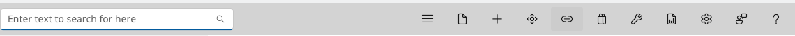
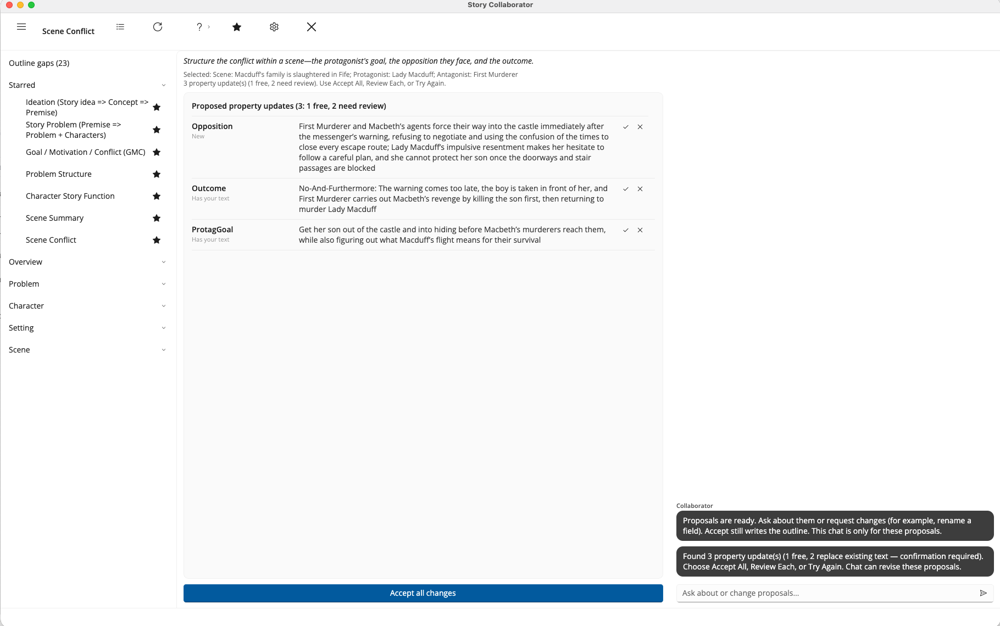
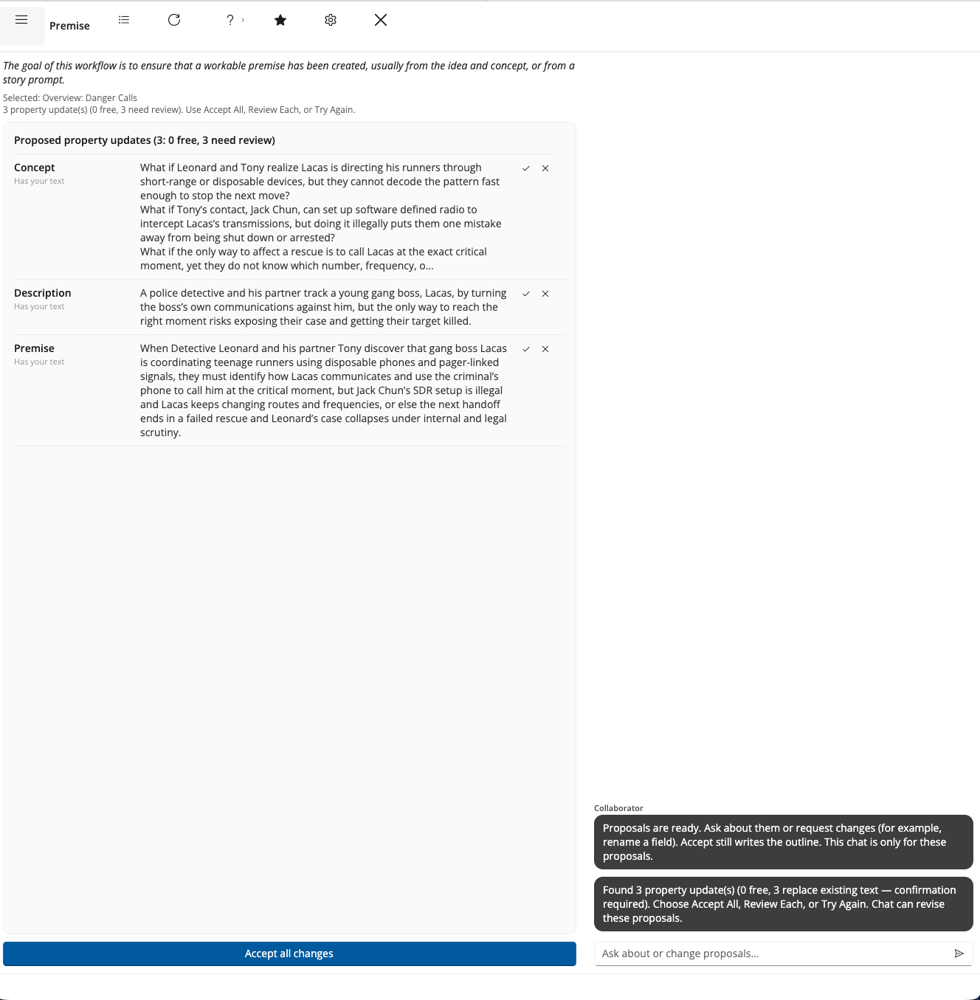

# Opening Collaborator

## Before you start

Collaborator works on the outline you have open in StoryCAD, so open one first. There is nothing separate to install; if Collaborator has not been switched on for you yet, [Getting Started](Getting_Started.html) explains how that happens during the beta.

## Launch Collaborator

With an outline open, click **Collaborator** on the StoryCAD toolbar. A separate window opens, titled Story Collaborator, and StoryCAD stays where it was behind it. If nothing happens, the usual reason is that your access has not been approved yet, or that StoryCAD has not been restarted since it was; Getting Started covers both.

## The Collaborator window

The window has three areas side by side. The left is the list of workflows, where you pick the one to run. The center shows the purpose of the workflow you picked and, after a run, the Property Updates list of suggested field changes. The right is the chat column, which carries status messages during a run and lets you ask questions afterward.

Across the top runs a bar of icons, from the left: a control that shows or hides the workflow list, the name of the workflow you are on, then Review Each, Try Again, Help, Customize Workflows, Settings, and Exit. Review Each and Try Again stay greyed until a run has left suggestions waiting. The bar is icons only, so hover over one to read its name. Accept all changes is not on that bar; it sits at the foot of the center column, directly under the Property Updates list it applies to.

A status strip along the bottom carries short messages when there is something to say, for example that you cancelled choosing a character. If you have turned on cost details in Settings, the running cost of the session sits at the right-hand end of the same strip.

## What the workflow list shows

The list on the left opens short and grows only when you ask it to, because seeing every workflow at once is not much help when you want to run one. From the top, it has up to three bands.

| Band | What it holds |
|------|---------------|
| Outline gaps | Required fields you have not filled in yet, with a count of the elements that have them. The row appears only when there are gaps, and it is usually the most useful thing to do next. |
| Starred | The workflows you have marked as yours. Five are starred to begin with, one for each stage of outlining. |
| Story element groups | Everything else, filed under Overview, Problem, Character, Story World, Setting, and Scene. These start closed; click a group to open it. |

Nothing is hidden. Every workflow that is not starred is one click away in its group, and the [Workflow Reference](Workflows/) describes each of them.

## Star the workflows you use

A star sits at the right of each workflow row. Click it to add that workflow to the Starred band, or click a filled star to take it out again. Starred workflows move to the top of the list, and the group they came from keeps the rest. Your stars are remembered between sessions and they are yours alone; they do not change your outline and they do not travel with the story file.

To change several at once, click **Customize Workflows** on the top bar. It lists every workflow with its short description and a checkbox, grouped by story element. Check the ones you want starred and choose Save.

## Show or hide the workflow list

The menu control at the left of the top bar, the three stacked lines, shows or hides the workflow list. Hiding it gives the work area the full width of the window, which helps when a run has produced a long Property Updates list, and the list is still there when you want another workflow.

## Settings

Click **Settings** on the top bar to open a short dialog of preferences. The three list fields take several entries separated by commas.

| Setting | What it does |
|---------|--------------|
| Response Terseness | How much text a suggestion carries: Concise, Balanced, or Detailed. |
| Genre Preferences | Genres to steer suggestions toward. |
| Story Forms I Like | Story shapes to lean into. |
| Story Forms to Avoid | Story shapes to keep away from. |
| Logging Visibility | Off, Basic, or Detailed. Detailed can expose prompts, so leave it off unless you are chasing a problem. |
| Show cost per run on the status bar | Turns on the cost line described below. |

Choose Save to apply your choices, or Cancel to leave them as they were. Response Terseness and the cost checkbox are remembered between sessions; the other four return to their defaults each time you open Collaborator.

## Cost on the status bar

With the cost checkbox on, the right-hand end of the bottom strip reports, after each run, the model that ran, the tokens in and out, what that run cost, and what the session has cost so far. Chat turns report the same way, one line per turn. When a run cannot be priced the line says so and the session total stays where it was. The figure sits beside status messages rather than replacing them, so a warning is never hidden behind a number.

## Exit

Click **Exit** to close Collaborator and return to StoryCAD. There is no Save button, because accepting an update writes it to your outline then and there; anything you did not accept is dropped when the window closes.
