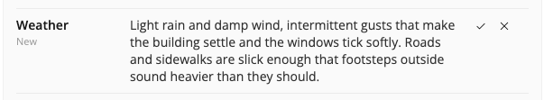
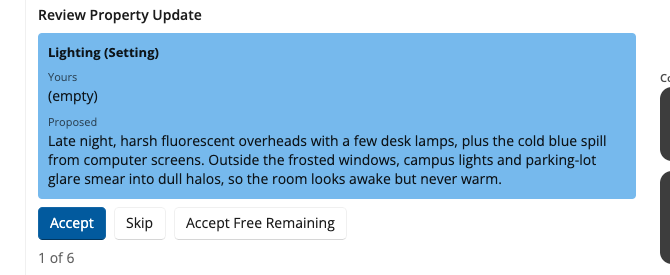

# Reviewing Suggestions

Reading the suggestions before you accept them is the habit that makes Collaborator safe to use. Collaborator proposes and you decide, and this page explains what the list shows you and what each of your choices does.

## The Property Updates list

After a run, the center of the window fills with a list headed Proposed property updates. Each row is one field on one story element, for example the Premise on the Overview or the protagonist's Goal on a Problem, with the proposed text beside it. The header counts the rows and sorts them into two kinds. A heading that reads 3: 1 free, 2 need review means three proposals are waiting, of which one will apply on its own when you accept all changes and two will not move until you say so, field by field.

## What the row labels mean

Under each field name is a label saying how Collaborator classified the field against what your outline already holds.

| Label | What it means | What Accept all changes does |
|-------|---------------|------------------------------|
| New | The field is empty | Applies it |
| Refresh | Collaborator wrote this field earlier in the same session | Applies it |
| Has your text | You, or your past edits, already filled the field | Skips it. Use Review Each if you want to replace your words |
| Update | A field that holds a list rather than a single value, so there is nothing to compare line for line | Applies it |

The New, Refresh, and Update rows are the free ones in the header count, and the Has your text rows are the ones that need review. This is how your writing is protected when you run a workflow a second time on a half-filled outline: a field you filled yourself, or accepted earlier and then edited, is never replaced in bulk.

## Accept all changes

The Accept all changes button sits at the foot of the list. It applies every New, Refresh, and Update row and leaves every Has your text field alone. Use it when you started from empty fields and want the first pass written in quickly. Afterwards, open the same element in StoryCAD and skim the form; the text is already there.

## Review Each

Click **Review Each** on the top bar to walk the list one field at a time. For each field the card shows Yours, the text in your outline now, and Proposed, what Collaborator suggests, with a count such as 1 of 6 so you know where you are. Three buttons follow. Accept writes the proposal into this field only. Skip keeps yours and drops the proposal. Accept Free Remaining applies every remaining New, Refresh, and Update row in one step and leaves the remaining Has your text fields for you to Accept or Skip one by one.

Accept Free Remaining is not the same as accepting every empty field. It also applies the Refresh rows, the fields Collaborator wrote earlier in this session, and it never overwrites a Has your text field in bulk.

## Try Again

Try Again on the top bar discards the waiting set and runs the same workflow again; [Running a Workflow](Running_a_Workflow.html) describes it. Use it instead of accepting a weak pass and editing afterward.

## Nothing is permanent until you accept

Closing Collaborator without accepting leaves the fields as they were. Accepting writes the text into your outline at once, so there is nothing further to do to keep it, and if you accept a suggestion and dislike it later, edit the field in StoryCAD as you would any other text. You are not locked in.
