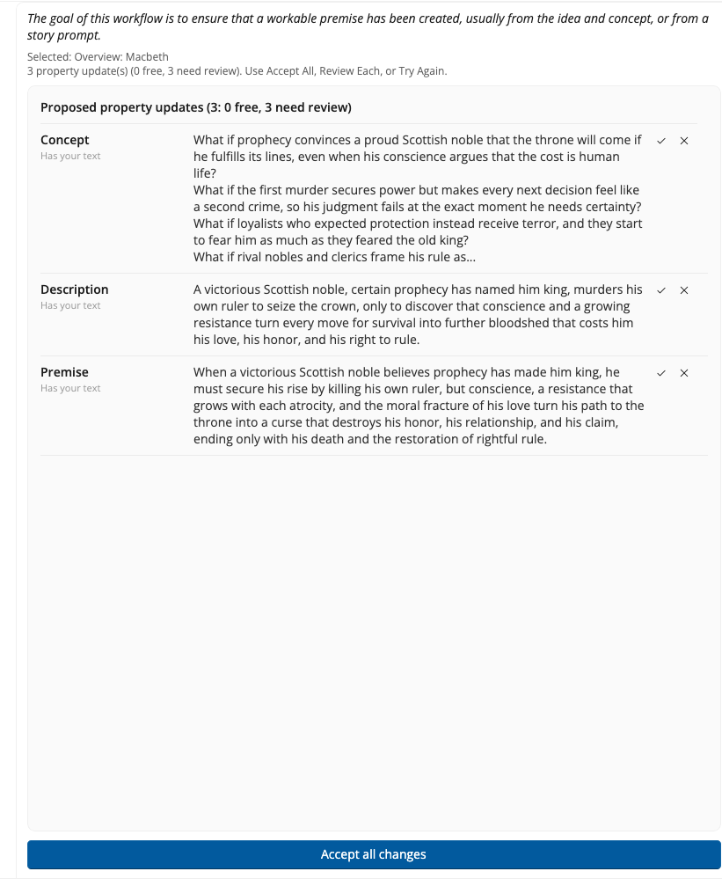

# Reviewing Suggestions

This is the most important habit in Collaborator: **read the suggestions, then choose**. Collaborator proposes; you dispose.

## Proposed property updates

After a run, the center list is headed **Proposed property updates**. Each row is one field on a story element, for example **Premise** or **ProtGoal**.

The header counts them. `(3: 1 free, 2 need review)` means three proposals waiting: one that applies on its own, and two that will not move until you say so.

## What the row labels mean

Under each field name is a label saying how Collaborator classified it:

| Label | What it means | What Accept all changes does |
|-------|---------------|------------------------------|
| **New** | The field is empty | Applies it |
| **Refresh** | Collaborator wrote this field earlier in the same session | Applies it |
| **Has your text** | You, or your past edits, already filled the field | **Skips** it. Use Review Each if you want to replace your words |
| **Update** | A field that holds a list rather than a single value, so there is nothing to compare line for line | Applies it |

**New**, **Refresh**, and **Update** rows are the *free* ones in the header count. **Has your text** rows are the ones that *need review*.

That protects your writing when you re-run a workflow on a half-filled outline.

## Accept all changes

**Accept all changes** sits at the foot of the list. It applies every **New** and **Refresh** update and leaves every **Has your text** field alone.

Use it when you started from empty fields and want the first pass written in quickly. Afterwards, open StoryCAD and skim the forms.

## Review Each

**Review Each** walks one field at a time.

For each field you see:

- **Yours**: what is in the outline now  
- **Proposed**: what Collaborator suggests  

Then choose:

| Button | Effect |
|--------|--------|
| **Accept** | Write the proposal into this field only |
| **Skip** | Keep yours; drop this proposal |
| **Accept Free Remaining** | Apply every remaining **New** and **Refresh** field in one step; still leave **Has your text** fields for Accept or Skip |

**Accept Free Remaining** is *not* “accept every empty field only.” It also applies **Refresh** rows, which are fields Collaborator wrote earlier in this session. It never bulk-overwrites a **Has your text** field.

## Try Again

**Try Again** discards the current pending set for a new run of the same workflow (see [Running a Workflow](Running_a_Workflow.html)). Use it instead of accepting a weak pass.

## Nothing is permanent until you accept

Closing Collaborator without accepting leaves those fields as they were. Accepting writes the text into your outline right away, so there is nothing further to do to keep it.

If you accept a suggestion and dislike it later, edit the field in StoryCAD. You are not locked in.
