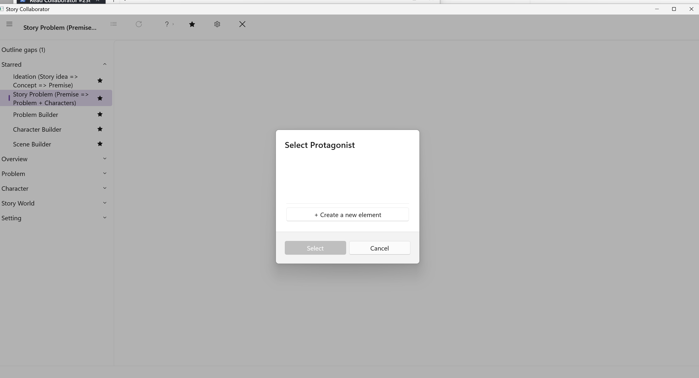

# Running a Workflow

## Pick a workflow

In the list on the left, click the workflow that matches the craft question you care about now. If you are not sure where to start, [A Path to Try](Tutorial/A_Path_to_Try.html) suggests an order, and the [Workflow Reference](Workflows/) describes what each workflow does before you commit to it.

Clicking a workflow runs it. There is no separate Run button and no confirmation step, so treat the click as the decision. The workflow's name appears on the top bar, and the center of the window shows its short description: the purpose of the run, not the full account, which is in the reference pages.

## Choose the story element when asked

Most workflows work on one story element, and Collaborator has to know which one. The Story Overview is chosen for you, because an outline has only one. For any other kind of element a picker opens before anything runs. If your outline has none of that kind, the picker offers to create one; if it has exactly one, that one is preselected, and you can accept it or create another; if it has several, you choose. When the workflow follows a link in your outline, such as the protagonist of the Problem you just picked, that character is preselected as well. A few workflows ask for more than one element in turn; Story Problem (Premise => Problem + Characters), for example, asks for a Problem and then two characters.

The picker is your chance to back out. Cancel it and the workflow does not run. Nothing has been written at that point, with one exception worth knowing: where a workflow links elements as you pick them, as Story Problem (Premise => Problem + Characters) does when it makes your choice the Story Problem on the Overview, that link is made at once. The Workflow Reference notes this for the workflows that do it.

## What Collaborator sends with the run

Along with the elements you picked, Collaborator sends a short account of where your outline stands, the same judgment the Outline gaps page shows as its Guess sentence, so that the suggestions fit an outline at that stage rather than a finished one. [Outline Gaps](Workflows/Outline_Gaps.html) explains how that judgment is made.

## Wait for the result

Collaborator runs the workflow and reports its progress in the chat column on the right. When it finishes, the chat shows a short status line saying how many updates are free and how many need review, and the center of the window fills with the Property Updates list, one row for each field Collaborator would like to change. Accept all changes appears at the foot of that list, and Review Each and Try Again come alive on the top bar. Nothing has been written into your outline yet; that happens only when you accept, and [Reviewing Suggestions](Reviewing_Suggestions.html) explains the choices.

## Try Again

If the first result misses the mark, click **Try Again** on the top bar. It runs the same workflow once more and replaces the waiting suggestions with a fresh set. You review and accept the new set the same way; nothing from the first pass is written unless you accepted it before trying again.

## After you accept

Open the same story element in StoryCAD's navigation pane. The fields you accepted hold the text you approved in Collaborator, and you can edit them there like any other text you typed. The outline is still yours.
