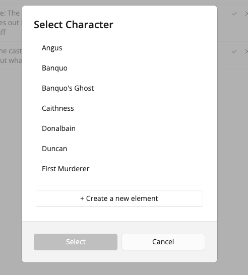
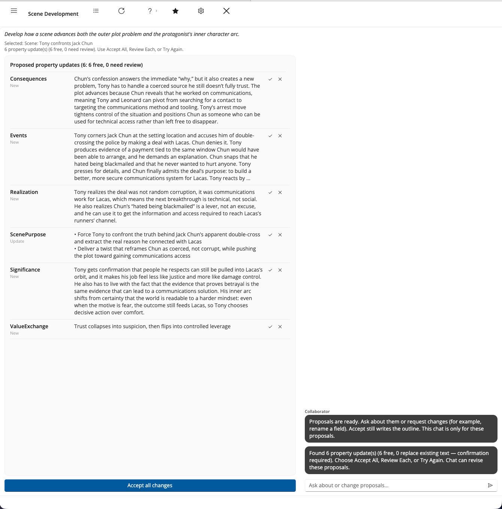

# Running a Workflow

## Pick a workflow

In the left list, click a workflow that matches the craft question you care about now. If you are unsure where to start, see [A Path to Try](Tutorial/A_Path_to_Try.html).

**Clicking a workflow runs it.** There is no separate Run button and no confirmation step, so treat the click as the decision. Its name appears on the top bar, and the center of the window shows a short description of what it is for: the purpose of the run, not the full craft essay.

## Choose story elements when asked

Some workflows need a specific element first: which Problem, which Character, which Scene. Collaborator opens a picker before it runs anything. Select an existing element, or create one when the dialog offers that.

This is your chance to back out. Cancel the picker and the workflow does not run.

## Wait for the result

Collaborator runs the workflow and reports progress in the chat column. When it finishes, you typically see:

- A short status, for example how many updates are free and how many need review
- A **Property Updates** list in the center: each row is one field Collaborator wants to change
- **Accept all changes** at the foot of that list, and **Review Each** and **Try Again** on the top bar

Nothing is written into those fields until you accept. See [Reviewing Suggestions](Reviewing_Suggestions.html).

## Try Again

**Try Again** runs the same workflow again with a fresh suggestion pass. Use it when the first result missed the mark. You still review and accept; a new run does not force old pending rows without your action.

## After you accept

Open the same story element in StoryCAD’s navigation pane. The fields you accepted should match what you approved in Collaborator. If something looks wrong, edit it in StoryCAD like any other text; the outline is still yours.
